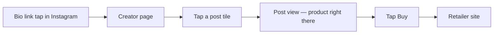

# Plugfolio — Complete Product Design Handoff

*The single document a designer needs: every flow, every screen, every state, every control — for all three roles, including authentication, landing, and the full dashboard. Visual language (color, type, iconography, imagery, motion) is **yours to propose**; product structure, flows, and rules below are fixed.*

*Version: v1 ("lean journey") · July 2026 · Everything described here is built and working; items marked **[LATER]** are designed-for but not yet live.*

---

## 1. What Plugfolio is

> A creator turns their content into a page where every post is shoppable.
> A follower taps a post and buys. **No account, no friction.**

Three roles, one rule:

| Role | Wants | Account? |
|---|---|---|
| **Shopper** | Buy the thing they just saw in a reel | **Never required to shop.** Optional account only to *follow* or *comment*. |
| **Creator** | Turn content into sales | Yes — email sign-in; owns up to 5 profiles; invites Managers |
| **Business** | Find creators to work with | Yes — email sign-in; posts requirements, runs collab threads |

**The golden rule that shapes every screen: an account is never the price of shopping.** No modal, no wall, no "sign up to continue" may ever appear on the path from arriving at a creator page to landing on the retailer. Sign-in surfaces exist only for "act as yourself" actions.

Second rule: **v1 handles no money.** Buy buttons forward to the retailer through the creator's own affiliate link. Never design a cart, checkout, wallet, or payout.

---

## 2. Design principles & constraints

1. **Mobile-first at 360 px.** Most visitors arrive from an Instagram/TikTok bio link **inside the app's in-app browser**. Design at 360 px first; desktop is a centered single column (current build caps content at ~448 px / `max-w-md`). No hover-dependent interactions — everything must work on first tap.
2. **Speed is a feature.** Public pages are server-rendered and must feel instant in an in-app browser. Avoid heavy imagery/animation on the shopper path.
3. **Accessibility is not optional.** WCAG AA contrast everywhere (watch bright accents on light backgrounds), every control keyboard-reachable and labeled, semantic headings, `prefers-reduced-motion` respected.
4. **Honest states.** Every screen below lists its empty/error states — design them all; none are edge-case afterthoughts. Metrics are labeled *tracked* (measured) — never imply data we don't have.
5. **Double-tap tolerance.** In-app browsers double-fire taps. Buttons show a busy state (`disabled` + label change) after first tap; the backend absorbs duplicates — the design just needs to make single-action feedback obvious.

### What you own vs. what's fixed

| Yours to define | Fixed (do not change) |
|---|---|
| Full color system (a "Charged Violet + Electric Lime" placeholder palette exists in code — treat it as replaceable), typography, spacing rhythm, radius, elevation, iconography, illustration/empty-state art, motion, light/dark strategy | Flows, information architecture, screen inventory, permission rules, copy *meaning* (you may polish wording), the no-login rule, the no-money rule |

### Deliverable contract (how your design reaches code)

Engineering consumes **semantic design tokens** — deliver values for: `--color-primary` (+foreground), `--color-accent` (+foreground), `--surface`, `--surface-muted`, `--text`, `--text-muted`, `--border`, `--ring`, a radius scale, a type scale (display face for headings + body sans), and a spacing scale. Components never hardcode hex, so a delivered palette restyles the entire product. Provide both light and dark values (dark-first is welcome but both must work).

Component base is **shadcn/ui** (Button, Card, Skeleton, inputs, textarea today). Design within that component grammar; new primitives (Dialog, Toast, Tabs, Avatar, Badge…) can be added when a screen needs them — flag where you want them.

---

## 3. Sitemap & navigation map

```mermaid
flowchart TD
    subgraph Public — no account ever needed
        HOME["/ — Landing"]
        CP["/[handle] — Creator page"]
        PV["/[handle]/post/[id] — Post view"]
        PP["/[handle]/product/[id] — Product page"]
        RET(("Retailer site\n(external)"))
    end
    subgraph Auth
        SI["/api/auth/signin — Sign in"]
        EMAIL[["Magic-link email"]]
    end
    subgraph Shopper account
        FOL["/following — Followed creators"]
    end
    subgraph Creator dashboard
        DB["/dashboard — Home (profiles + earnings)"]
        POSTS["/dashboard/posts — Posts tab"]
        EDIT["/dashboard/posts/[id] — Tagging editor"]
        PROD["/dashboard/products — Products tab"]
        CCOL["/dashboard/collabs — Collabs tab"]
        SET["/dashboard/settings — Settings (Admin only)"]
    end
    subgraph Business
        BIZ["/collabs — Business home"]
        THREAD["/collabs/[id] — Collab thread (both roles)"]
    end

    HOME --> CP --> PV --> PP
    PV -- "Buy" --> RET
    PP -- "Buy" --> RET
    CP -- "Follow / Comment (needs account)" --> SI
    SI --> EMAIL --> DB
    EMAIL --> FOL
    EMAIL --> BIZ
    DB --> POSTS --> EDIT
    DB --> PROD
    DB --> CCOL --> THREAD
    DB --> SET
    BIZ --> THREAD
    CP -- "Request collab (business viewer)" --> THREAD
```

**Navigation model:** there is no global nav bar in v1. Public pages navigate contextually (grid tile → post → product → back links). The dashboard has a text-link tab row on its home. Every sub-page carries a `← back` link, top-left. (You may propose a persistent dashboard nav — bottom tab bar on mobile is a natural fit — as long as the link set matches the permission rules below.)

---

## 4. Roles & permissions (drives what each viewer sees)

| Capability | Anonymous | Shopper acct | Creator **Admin** | Creator **Manager** | Business |
|---|---|---|---|---|---|
| Browse creator pages, posts, products; Buy | ✅ | ✅ | ✅ | ✅ | ✅ |
| Read comments | ✅ | ✅ | ✅ | ✅ | ✅ |
| Follow / write comment | door → sign-in | ✅ | ✅ | ✅ | ✅ |
| See "Request collab" form on a creator page | — | — | — | — | ✅ (owns a business) |
| Dashboard: Posts / Products / Earnings / Collabs tabs | — | — | ✅ | ✅ (for managed profiles) | — |
| Create posts, tag products, fix/remove products | — | — | ✅ | ✅ | — |
| Dashboard **Settings** (Managers; later username/connections) | — | — | ✅ | ❌ hidden + blocked | — |
| Create profile (needs ≥1 connected social; max 5/account) | — | any signed-in user may become a creator | ✅ | ❌ | ✅ (same account rules) |
| Business surface: create business, post requirements, threads | — | — | — | — | ✅ |

One email account can hold any mix of roles. A "shopper account" is just an account with no profiles/business.

---

## 5. The five journeys (flows to design end-to-end)

### 5.1 Shopper: tap → see → buy (the product's soul)


Zero interruptions. Buy shows a brief busy state ("Opening…") while the tap is recorded, then forwards **even if recording fails**. Target: bio-link tap → retailer in 3 taps.

### 5.2 Shopper: the one optional account
Creator page → tap **Follow** (or try to comment) → sign-in door → email → magic link → back, now following / comment box available. Payoff surface: **/following** (simple list of followed creators). Never triggered by any buy action.

### 5.3 Creator: sign up → connect → profile → tag → live
1. Email sign-in (account exists in one step, nothing else asked)
2. **[LATER live / design now]** Connect Google (YouTube) + Meta (Instagram) — until OAuth apps exist, dashboard shows an explanatory connect notice
3. "New profile" → instant profile with a random handle (`creator-a1b2c3d4`) — page works immediately
4. Posts tab → add post (today: media URL + caption; **[LATER]** auto-import replaces this)
5. Open post → paste product URL → *Plugfolio grabs title/image/price* → paste affiliate link → **Tag product** → the post is shoppable
   *The magic moment. Design the before/after of "my reel is now shoppable" to feel like a win.*

### 5.4 Creator Admin ↔ Manager
Admin: Settings → invite Manager by email (cap 3) → Manager signs in with that email → sees the managed profile (badged "manager") → can post/tag/fix products and work Collabs → cannot see Settings. Admin can remove a Manager anytime.

### 5.5 Business: two doors to a creator
- **Door 1:** create business → post a requirement (what you need, brief, budget text, deadline) → it lists on the open board inside creators' Collabs tab → a creator taps **Approach** with an opener → thread.
- **Door 2:** business browses any creator page → **Request collab** form under the Follow button → thread lands in the creator's Collabs.
- Thread: both sides message, each taps **Accept terms**; when *both* have accepted the thread is **Agreed — payment settles off-platform**.

---

## 6. Screen-by-screen specification

Layout notation: single mobile column, regions listed top-to-bottom. "Copy" quotes the current build — meaning is fixed, wording is polishable.

---

### 6.1 `/` — Landing page  *(needs the most design love — currently a bare value-prop placeholder)*

- **Purpose:** explain Plugfolio in one scroll and route the three roles. It is *not* on the shopper's hot path (shoppers arrive at `/[handle]` directly), so it may be richer/heavier than shop pages.
- **Must contain:** headline value prop ("Shoppable creator pages"), an explicit "no login to shop" promise, a role router (Creator → sign in / see a demo page · Business → /collabs · curious shopper → a sample creator page), footer.
- **Must NOT contain:** any sign-in *wall*, any link labeled in a way that implies shopping needs an account.
- **States:** none (static).

### 6.2 `/[handle]` — Creator page (the shop window)

- **Access:** public. A session only *enriches* it.
- **Regions top-to-bottom:**
  1. **Creator header** — centered: avatar (80 px circle; placeholder disc until avatars exist), display name (falls back to handle), `@handle` in muted text.
  2. **Follow button** — centered under header. States: anonymous → outline "Follow" that routes to sign-in; signed-in not-following → outline "Follow"; following → quiet/ghost "Following" (tap to unfollow); busy while toggling.
  3. **Request collab strip** — *only when the viewer owns a business*: one-line input ("We'd love a reel featuring our product…") + "Request collab" button → success swaps to "Request sent — check your Collabs."
  4. **Post grid** — 3 columns, 4 px gutters, square tiles, small radius, entire tile tappable → post view. Tile = post media (cover-cropped). Empty state: "No posts yet."
  5. **Comments** — heading; newest-first list (author display name or "Shopper" — **never an email**, muted body text); then either the comment composer (signed-in: 2-row textarea, 500-char max, "Post" button, inline error line) or the door: "**Sign in** to comment — shopping never needs an account." Empty list: "No comments yet."
- **Not-found handle → 6.16.**

### 6.3 `/[handle]/post/[id]` — Post view ("this is what's in the video")

1. `← @handle` back link
2. Post media — full-width square, rounded
3. Caption (plain text, optional)
4. **Tagged products** — stacked cards: 64 px product photo (left, links to product page) · title (medium, truncates, links) + price muted below · **Buy** button right (accent variant; busy label "Opening…"). Buy records the tap and forwards to the retailer — never blocks on failure.
5. Empty: "No products tagged on this post."
- Unknown/foreign post id → 404.

### 6.4 `/[handle]/product/[id]` — Product page

1. `← @handle`
2. Product photo — full-width square (omit region if none)
3. Title (display size) · price (muted) — price is display-only, grabbed at tag time; retailer owns the real price
4. **Buy** — accent button, same behavior as above
5. **From this post** — label + 96 px thumbnail linking back to the source post (omit if none)

### 6.5 Buy interaction (component-level spec)

Tap Buy → button disables, label → "Opening…" → tap recorded in background → browser navigates to affiliate URL. Requirements: obvious single-action feedback (double-taps must feel absorbed, not broken), no interstitial, no confirmation, no account prompt ever. Failure of recording is invisible to the shopper.

### 6.6 `/api/auth/signin` — Sign-in  *(currently the default Auth.js page — design a branded replacement)*

- **One method today:** email → magic link. Layout: brand mark, one email field, one submit ("Sign in with Email"), reassurance copy ("We'll email you a sign-in link. No passwords."), and — important for tone — a line reminding shoppers they don't need this to buy.
- **Post-submit state:** "Check your email" confirmation screen (design it; the default is bare).
- **[LATER]:** "Continue with Google" / "Continue with Instagram" buttons appear above email once OAuth credentials exist (already wired in code — design the buttons now).
- **Error states:** invalid email; expired/used magic link ("link expired — request a new one").
- **Magic-link email template** (design asset): brand header, one button ("Sign in to Plugfolio"), plain-URL fallback, expiry note (24 h), ignore-if-not-you line.

### 6.7 `/following` — Followed creators (shopper payoff)

`Following` heading → simple list of `@handle` links (tap → creator page). Empty: "You aren't following anyone yet. Tap Follow on a creator's page." Signed-out → redirected to sign-in. *(The rich aggregated content feed is deliberately NOT in v1 — don't design it here.)*

### 6.8 `/dashboard` — Creator dashboard home

- **Access:** any signed-in user (it's also where a new user becomes a creator).
- **Regions:**
  1. Header: "Dashboard" + account email (muted)
  2. **Tab row** (text links today — you may propose real tabs/bottom bar): `Posts · Products · Collabs` + `Settings` **only when the active profile's role = admin**
  3. **Profiles section** — heading + **"New profile"** button (top-right).
     - Switcher: chips per accessible profile — `@handle`, active chip emphasized (primary border), managed profiles suffixed "· manager". Tapping a chip re-scopes every tab (`?profile=` carries through all dashboard URLs).
     - Empty + no connection: "Connect a Google or Meta account to create your first profile." plus the muted note that connect buttons appear on the sign-in page once OAuth apps are configured **[LATER: replace with real Connect YouTube / Connect Instagram buttons + connected-state chips — design both states now]**
     - Empty + connected: "No profiles yet — create one to get your shoppable page."
     - "New profile" errors, inline: no connection (403 message) · "An account holds at most 5 profiles."
  4. **Earnings section** (for the active profile — this *is* the Earnings tab in v1):
     - Stat card: big number = total outbound taps, sub-label "outbound taps · **tracked**" (the tracked label is a product promise — keep it)
     - "By post" card: rows of post caption ("Untitled post" fallback) ··· right-aligned "N taps", most-tapped first. Empty: "No post-driven taps yet."
     - "By product" card: same pattern with product titles.
     - **[LATER]** "estimated" conversion figures join these cards when affiliate networks report back — leave visual room for a second, clearly-differentiated label.

### 6.9 `/dashboard/posts` — Posts tab

1. `← Dashboard` · heading "Posts · @handle"
2. Post list rows: 56 px thumbnail · caption/"Untitled post" (truncating) · right muted "N tagged". Row → tagging editor. Empty: "No posts yet — add your first below."
3. **Add a post** form: Media URL (url field) + Caption (optional) + "Add post". *(Manual entry is the interim source — **[LATER]** this whole section is replaced by auto-imported posts from connected socials; design the list to survive that swap.)*

### 6.10 `/dashboard/posts/[id]` — Tagging editor (the core tool)

1. `← Posts`
2. Post media preview (square) + caption
3. **Tagged products** — rows: title ··· price ("—" when none). Empty: "Nothing tagged yet."
4. **Tag a product** form:
   - "Product URL" field — helper: *we grab title, image & price* (an unreadable page falls back to the page's hostname as title — silent, never an error)
   - "Your affiliate link" field
   - "Tag product" (busy: "Tagging…"); inline error line
   - On success the new product appears in the list above — **make this the celebratory moment** (the post just became shoppable).

### 6.11 `/dashboard/products` — Products tab ("fix a link, remove one")

1. `← Dashboard` · heading "Products · @handle"
2. Divided rows per product: title + **Remove** (quiet/ghost, right) on line one; line two = affiliate-URL input + **Save** (enabled only when edited, busy "Saving…"); inline error line. Includes products whose post was deleted.
3. Empty: "Nothing tagged yet — tag products from a post in **Posts**."
   *(Consider a delete-confirmation pattern — removing a product also removes its recorded taps from the projection.)*

### 6.12 `/dashboard/collabs` — Creator's Collabs tab

1. `← Dashboard` · "Collabs"
2. **Your threads** — rows: `@`-less business name · "· requirement title" muted (when door-1) ··· right status chip **Agreed** / **Negotiating**. Row → thread (6.15). Empty: "No collabs yet."
3. **Open requirements** — card per brief: title (bold), business name · budget text (muted), brief body, then an **Approach** composer (one-line opener input + button). No-profile visitors see the board read-only + "Create a profile to approach requirements."

### 6.13 `/dashboard/settings` — Settings (Admin only)

1. `← Dashboard` · "Settings · @handle"
2. **Managers** — explainer: "Up to 3 people who can post and tag on this profile. Settings and connections stay yours." List rows: name/email + quiet **Remove**. Invite: email field + **Invite** button. Inline errors: cap reached ("A profile has at most 3 Managers"), self-invite, invalid email. Empty: "No Managers yet."
3. **[LATER — design now]** Username section: pick your public handle *only from handles on your connected YouTube/Instagram* (self-verifying); shows current random handle until then; taken-handle state ("first verified owner keeps it").
4. **[LATER — design now]** Connections section: Google/Meta connect state, re-authenticate, and the rule "can't disconnect while a profile depends on it — delete the profile first."
- A Manager navigating here is silently redirected to /dashboard (also design nothing that leaks its existence to them).

### 6.14 `/collabs` — Business home

- **First visit (no business yet):** heading "Create your business" + sub "A name and what you sell — that's the whole sign-up." Form: Business name (80) · "What do you sell?" textarea (280) → **Create business**. *(Logo upload is schema-ready — optional field you may include.)*
- **After creation:**
  1. Header: business name + description
  2. **Threads** — same list pattern as 6.12 but showing `@creator` per row
  3. **Your open requirements** — compact list (title · budget) + **post-requirement form**: "What do you need?" (120) · "The brief" textarea (1000) · "Budget or price range (optional)" free text (60 — *never* a currency-validated field; v1 handles no money) → **Post requirement**.

### 6.15 `/collabs/[id]` — Collab thread (both roles, one design)

1. `← Collabs` (routes to whichever side you came from)
2. Header: "**Business × @creator**" title; sub-line = requirement title or "Direct collab"; when fully agreed append "**· Agreed — payment settles off-platform**" (design as a distinct settled state, e.g. badge)
3. Message list, oldest-first: sender name bold (business name or `@handle`) + body muted. (Plain rows today — you may propose bubbles; keep sender attribution unambiguous.)
4. Composer: one-line input + **Send**
5. **Agreement row:** left = honest other-side status ("The other side has accepted." / "…hasn't accepted yet."); right = **Accept terms** (accent) → after accepting becomes quiet "You accepted" (irreversible in v1).
- Non-participants get a 404 — the thread must not exist for them.

### 6.16 System screens

| Screen | Spec |
|---|---|
| **404** | "This page doesn't exist." + link home. Also used for foreign posts/products/threads. |
| **Error boundary** | Friendly "something went wrong" + **Try again** button (re-renders). No stack traces. |
| **Loading** | Skeleton mirroring the creator page (avatar disc + name lines + grid blocks). Extend the skeleton pattern to dashboard lists. |
| **Redirects** | All gated pages bounce straight to sign-in with no flash of protected content. |

---

## 7. Component inventory (current grammar)

- **Button** — variants: primary, accent (the Buy/CTA color), outline, ghost/quiet; sizes sm/md/lg; disabled+busy label pattern.
- **Card** — header (title, description) + content; used for earnings stats, requirement briefs, product rows.
- **Skeleton** — loading placeholders.
- **Inputs** — text/url/email single-line, 2–3-row textareas; label-above, inline error line below-left (`role="alert"`), muted helper text.
- **Chips** — profile switcher (bordered pill, active = primary border).
- **Status chips** — Agreed / Negotiating; "tracked" metric label; "· manager" badge.
- Worth proposing: Toast (success feedback), Dialog (destructive confirms), Avatar, Tabs / bottom nav, Badge.

---

## 8. Copy & tone

Plain, confident, anti-corporate; the product's personality is *removing* friction. Say the quiet parts loudly: "shopping never needs an account," "tracked," "payment settles off-platform." Errors are specific and human ("A profile has at most 3 Managers"), never codes. You may rewrite copy freely as long as the stated meaning and the honesty labels survive.

---

## 9. Explicitly OUT of v1 (do not design these into the flows)

Referral rewards · wishlists/price alerts · aggregated feed · in-store deals · ratings/badges · media kits & campaign suites · on-platform payments/payouts · coupons/bundles · TikTok · AI tag suggestions · >5 profiles, >3 managers, finer roles · vanity usernames · creator-to-creator collabs. (Full rationale table lives in `plugfolio-lean-journey.md`.)

## 10. Open questions for you

1. Dashboard navigation: keep the light text-tab row, or a persistent bottom tab bar on mobile?
2. Dark-first or light-first as the default public-page appearance (both must exist)?
3. Post grid at >3 columns on desktop, or keep the mobile column centered?
4. Empty-state illustration style — illustrated, typographic, or minimal?
5. The "Agreed" settled state in threads — badge, banner, or timeline event?

*Companion docs if you want more depth per page: `docs/design/00-foundations.md` and briefs 01–12 in this folder; product scope in `plugfolio-lean-journey.md`.*
