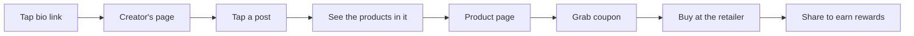
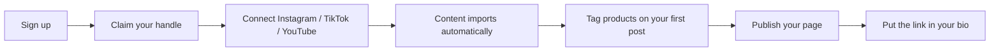
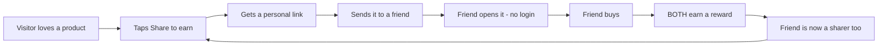

# Plugfolio — Features & User Journeys Guide

*A plain-language walkthrough of what the application does, who uses it, and how each journey works. July 2026.*

**Companion docs:** [`plugfolio-product-spec.md`](./plugfolio-product-spec.md) (technical spec, architecture & diagrams) · [`plugfolio-product-document.md`](./plugfolio-product-document.md) (product-owner brief) · [`plugfolio-competitive-analysis.md`](./plugfolio-competitive-analysis.md)

---

## 1. What is Plugfolio?

Plugfolio turns a creator's social content into a **shoppable storefront**.

A creator connects their Instagram, TikTok, and YouTube. Their posts and videos flow into Plugfolio automatically. The creator then **tags the real products** that appear in each post — the shoes in a reel, the camera in a video, the desk in a photo. All of it lives at one link:

> **plugfolio.com/yourhandle**

The creator drops that link in their bio. From then on, anyone who taps it can see every post, tap any post to reveal the products in it, and buy — **without ever creating an account or logging in**.

### The three promises

| Promise | What it means |
|---|---|
| **No login, ever (for shoppers)** | Visitors browse, shop, grab coupons, and even earn rewards without an account. Every login wall costs a sale — so there are none. |
| **Open to every creator** | No follower minimum, no application, no invite. Anyone can build a shop. (Competitors gate at ~5,000 followers or invite-only.) |
| **Sharing is rewarded** | When a visitor shares a shop or product and their friend buys, **both of them earn a reward**. No other platform rewards the shopper. |

---

## 2. Who uses Plugfolio?

There are three kinds of people in the application:

### 🛍️ The Visitor (shopper)
A follower who tapped a creator's bio link, or someone browsing Explore. They have **no account**. They can see everything public, buy anything, grab any coupon, save items, and share to earn rewards.

### 🎬 The Content Editor (creator)
The person who owns the shop. They **register an account** and work inside a private dashboard where they import content, tag products, customize their page, answer brand inquiries, read analytics, and collect payouts. Visitors never see the dashboard — only its published result.

### 🏢 The Brand (later phase)
A company looking for creators to partner with. They browse creator media kits and send inquiries. Brand tools arrive after the creator and shopper sides are healthy.

---

## 3. The Visitor journey

### 3.1 How a visitor arrives

There are three doors in:

1. **A creator's bio link** — the most common. They saw a reel, tapped the profile, tapped the link.
2. **A shared link from a friend** — "look at this" — which quietly carries a referral reward for both of them.
3. **Explore** — landing on Plugfolio directly and browsing what's trending.

### 3.2 The journey, step by step

**Step 1 — Land on the creator's page.**
The page loads instantly (it opens inside Instagram/TikTok's built-in browser, so speed matters). The visitor sees the creator's photo, bio, social links, a grid of their content, their curated shop sections, and any active coupons. No popup, no "sign up to continue."

**Step 2 — Tap any post.**
Tapping a reel or photo opens it with the **tagged products laid over or beneath it** — "here's exactly what's in this video." This is the signature interaction: content becomes a shop window.

**Step 3 — Open a product.**
The product page shows photos, price, the brand, **which post it appeared in**, whether the creator *actually uses it* (a badge earned when a product shows up repeatedly in their real content), ratings from other shoppers, and any active coupon.

**Step 4 — Grab a coupon (optional).**
One tap copies the creator's discount code. No login. If the deal is time-limited, a countdown shows the urgency ("2 days left").

**Step 5 — Buy (or grab the deal).**
What happens depends on the kind of product (see §4.5):
- **Affiliate product** — the Buy button sends the visitor to the retailer's site (with the creator's coupon code copied). The click is tracked so the creator gets credit — the visitor just experiences a normal purchase.
- **In-store deal** — no online checkout at all: the visitor sees *which store, which area, how much off, until when*, and redeems it in person during the deal period.
- **Creator's own product** — checkout happens right on Plugfolio through its payment gateway, as a **guest** — email for the receipt, still no account.

**Step 6 — Share and earn.**
After grabbing a coupon or buying, the visitor is invited to **share the shop or product with friends**. They get a personal share link. If a friend buys through it, **both earn a reward** — the sharer and the buyer. The friend who just bought now has their own reason to share. That's the loop.

### 3.3 Everything a visitor can see

| Page | What's on it |
|---|---|
| **Explore** | Trending products, top creators, hot coupons, limited-time drops, categories, referral-bonus banners, "picked for you" based on what they've browsed (device-only, no account). |
| **Search / Discover** | One search box covering products, creators, and coupons — with filters for category, price, creator, and brand. If nothing matches, helpful suggestions instead of a dead end. |
| **Creator page** (`/handle`) | The creator's *about* page: identity, socials, content grid, featured categories, coupons and deals, a **Connect** button, and a "share this shop" prompt. |
| **Category sub-pages** (`/handle/gym-kit`) | Creator-made categories — each is its own shareable page holding a group of items, every item with its video preview embedded. |
| **Product page** | Details, price, source post, creator attribution, "actually uses this" badge, ratings, coupon, buy button, share-to-earn. |
| **Category pages** | Products and creators grouped by category. |
| **Deals page** | All grabbable coupon codes plus **in-store deals near you** — physical-store discounts creators have announced, with location and validity period. |
| **Rewards page** | How share-to-earn works, what they've earned, and how to redeem it. |

### 3.4 Everything a visitor can do — all without an account

- **Browse** every page above — including creators and products they've never followed, via global search.
- **Buy** — tracked redirect to the retailer, or **guest checkout on Plugfolio** for a creator's own products.
- **Find in-store deals nearby** — local store discounts, redeemed in person.
- **Connect with creators** — one tap to follow any creator on-platform; connected creators fill a personal "My Creators" feed.
- **Grab coupons** — one-tap copy.
- **Share to earn** — personal link; friend buys → both rewarded.
- **Save to wishlist** — stored on their device; an optional email magic-link lets them keep it across devices (still no account).
- **Get alerts** — price drops or back-in-stock on wishlisted items, via browser notification.
- **Rate products** — one-tap star rating. (Written comments require a quick email verification — the single small exception to "no identity," to keep comments honest.)
- **Build a "My Creators" circle** — import who they follow on Instagram and get one shoppable feed across all of those creators (see §3.5).
- **Report** a broken link or bad listing.

### 3.5 "My Creators" — shop everyone you follow, in one feed

Instead of visiting creators one page at a time, a visitor can build a personal circle: one feed showing new products, coupons, and drops from **every creator they already follow on Instagram**.

Instagram doesn't let apps read your follow list directly — so Plugfolio walks the visitor through Instagram's own official data export:

1. Open Instagram **Account Settings** → **Download or transfer information** and select your account.
2. Choose **Some of your information** → scroll to *Connections* → select **Following**.
3. Choose **Export to device**, set the date range to **All time**, and set the format to **JSON**.
4. Tap **Create file**, then wait for Instagram's email — this can take up to an hour. (Plugfolio can nudge you when it's time to come back.)
5. Upload the file to Plugfolio.

Plugfolio reads the file **on your device** — only the list of handles is used; the file itself is never uploaded. Then:

- Every followed account that's on Plugfolio joins your **My Creators** feed instantly.
- For favorites who *aren't* on Plugfolio yet, one tap sends them an invite — so shoppers literally pull their favorite creators onto the platform.

No account needed: the circle lives on your device, and an optional email magic-link keeps it across devices — same as the wishlist.

---

## 4. The Content Editor journey

### 4.1 Getting started (onboarding)

**Step 1 — Sign up and claim a handle.** Email or social sign-in. The handle becomes the public URL: `plugfolio.com/yourhandle`. No follower minimum, no approval wait.

**Step 2 — Connect socials.** One OAuth tap per platform. Posts, reels, and videos start importing immediately and keep syncing on their own. (If a platform's API misbehaves, the editor can always paste a post URL manually — syncing never blocks them.)

**Step 3 — Tag the first products.** Open any imported post, then either search the product catalog or **paste any product URL from any store** — Plugfolio fetches the image, title, and price automatically. Attach an affiliate link or discount code if there is one. Preview exactly what visitors will see.

**Step 4 — Publish.** The storefront is auto-generated from the tagged products. One click makes the page live. The editor copies their link into their Instagram/TikTok bio — done.

The "aha" moment the whole onboarding drives toward: **seeing your own content become shoppable.**

### 4.2 The dashboard — the editor's workspace

Editors work in a private dashboard, completely separate from the public pages. The public page is the shop window; the dashboard is the back room.

| Section | What the editor does there |
|---|---|
| **Overview** | Today at a glance: visits, clicks, sales, earnings. Nudges like "6 posts have no products tagged yet." New brand inquiries. |
| **Content** | Every synced post from every platform. Filter by tagged/untagged. Hide any post from the public page. Trigger a re-sync. |
| **Mapping editor** | The core tool: open a post, tag products onto it, position the tags, attach links and codes, preview as a visitor, publish. Coming later: AI that suggests the products it can see in the frame, and bulk-tagging one product across many posts at once. |
| **Products** | The product library. Fix dead links (Plugfolio checks nightly and flags broken or out-of-stock links before followers hit them), group products into collections, see which products perform. |
| **Storefront** | Design the public page: reorder sections, feature collections ("My gym kit", "Desk setup"), pin best products, adjust the look. Live preview. |
| **Media kit** | An auto-updating one-pager for brands: audience size, reach, top content, past collaborations. Share as a link (with "Brand X viewed your kit" tracking) or export as PDF. Zero maintenance — it builds itself from synced stats. |
| **Brand inbox** | Brand inquiries arrive here (from the "Work with me" button on the public page). Track each deal through stages: new → negotiating → active → done. |
| **Analytics** | The emotional core: **"this reel made you $214."** Every click and sale is tied back to the exact post that caused it. Top products, coupon usage, revenue over time. Honest labels distinguish *tracked* revenue from *estimated*. |
| **Coupons & links** | Create discount codes and affiliate links. Schedule them: set a launch time and an expiry, and they publish and disappear on their own. |
| **Payouts** | Earnings balance, payout history, bank details, tax info. |
| **Referrals** | Invite other creators, earn when they join and sell. |
| **Settings** | Handle, profile, connected accounts, notifications. |

### 4.3 A week in the life of an editor

- **Monday** — posts a new reel on Instagram. It appears in the dashboard within the hour. Opens it on her phone, uses the quick-map flow to tag the three products in it, done in two minutes.
- **Tuesday** — dashboard flags one product link as dead (the retailer moved the page). She pastes the new URL; fixed everywhere it was tagged.
- **Wednesday** — a brand inquiry lands in the inbox. She checks her auto-updated media kit, sees the brand already viewed it twice, replies with her rate.
- **Thursday** — schedules a weekend coupon: goes live Friday 6pm, expires Sunday midnight. Sets her new "haul" products to be available for 48 hours only — the countdown creates urgency.
- **Friday** — checks analytics: the Monday reel drove 312 clicks and $214 in attributed sales. Shares the win, which is itself a Plugfolio link.

### 4.4 Everything an editor can do — feature list

**Core (launch):**
- Register with no gate; claim a public handle
- Connect Instagram, TikTok, YouTube; auto-import and auto-sync content
- Tag products on any post — search catalog or paste any product URL (auto-fetched)
- Attach affiliate links and discount codes to tags
- Auto-generated storefront; customize sections, collections, featured products
- Publish one public link for everything
- Per-post analytics: clicks, sales, revenue attributed to the exact post
- Create and manage coupons
- Receive payouts

**Growing the toolkit (fast-follow):**
- AI-suggested product tags (the model spots products in the frame; editor confirms)
- Bulk-tag one product across many posts
- Dead-link and out-of-stock detection with fix-it nudges
- Auto-updating media kit with view tracking and PDF export
- Brand inbox with deal pipeline
- Content insights: best time to post, which content styles convert
- Scheduled coupons (auto-publish, auto-expire)
- Product availability windows (live for 2 days, then auto-disabled — limited drops)
- "Shop the look" bundles (group tags into a purchasable set)
- Mobile quick-map (tag a post from the phone in under a minute)

**Later:**
- Creator collabs — shared collections, commission splits, tagging each other
- Favorite buyers — tag your best customers, see them highlighted, give them perks
- Own physical products with shipping and fulfillment
- Digital products and tips
- Full brand marketplace participation (campaigns, gifting)

### 4.5 The three kinds of products

Everything a creator publishes is one of three types — each with a different way of buying:

| | **Affiliate product** | **In-store deal** | **Own product** |
|---|---|---|---|
| **What it is** | A product sold elsewhere (Amazon-style): "buy it here, use my code for a discount" | A discount at a **physical store**: "this store in this area has 20% off until Sunday — on everything" | The creator's **own** product, sold directly |
| **How the visitor buys** | Buy button → retailer's website (coupon copied, click tracked) | Sees store, area, discount, and deal period → walks in and redeems in person | **Checkout on Plugfolio** through its payment gateway, as a guest (email for receipt only) |
| **How the creator earns** | Affiliate commission | Their arrangement with the store — Plugfolio proves the traffic | Sale price, paid into their account through Plugfolio |
| **Where visitors find it** | Creator pages, search, Explore | Deals page + "deals near you" on Explore | Creator pages, search, Explore |
| **When it ships** | Launch | Fast-follow | Digital products first, physical (with shipping) later |

In-store deals are worth a special note: **no competitor does local, offline deals** — it's a genuinely new angle, and it fits a regional launch where local store culture is strong.

### 4.6 Building the page: about + your own categories

The creator's public presence is a small site, not one long page:

- **The main page** (`/handle`) is *about the creator* — who they are, their socials, highlights, featured categories, active coupons and deals.
- **Category sub-pages** (`/handle/gym-kit`, `/handle/skincare`…) are created by the creator, named whatever they want, holding whatever group of items they choose. Each category is its own page with its own shareable link. Create as many as needed, reorder them, hide them.
- **Every product carries its video.** Attach the YouTube or Instagram video the product appears in, and the product page shows an **embedded preview** — the visitor watches the moment the product was worn/used, right next to the buy button. (Where Instagram blocks embedding — common inside in-app browsers — a thumbnail with a tap-out link takes its place, so nothing ever looks broken.)

---

## 5. The reward loop — how sharing works (both sides)

This is Plugfolio's growth engine, so it deserves its own walkthrough:

- **What's the reward?** Platform credit (funded from the affiliate commission, so it costs the platform margin, not cash), redeemable against future purchases.
- **How does it work without accounts?** The share link itself is the identity. Rewards attach to the link and the device; a claim link lets the visitor redeem. No signup required at any point.
- **What stops cheating?** Self-referral detection, velocity limits, and a holding period matching the retailer's return window before rewards are approved.
- **Why it matters:** every purchase creates a new sharer. For a brand-new marketplace, this loop is how empty shelves become full — shoppers bring shoppers, and traffic proves to creators that Plugfolio is worth their time.

---

## 6. Plug Connect — the relationship layer

Plug Connect is how people and creators form lasting links on the platform — and how creators finally *see* their audience.

### Shoppers connect with creators
Any visitor can tap **Connect** on a creator's page — no account, it lives on their device like the wishlist. Their connected creators feed a personal **"My Creators"** page: new products, fresh coupons, live drops from everyone they follow, in one place. The Instagram follow-list import (§3.5) is just the bulk version of this — connect with everyone you already follow, in one upload.

### Creators connect with creators
Creators link up with each other too. A connection between creators unlocks collaboration: tagging each other's products, shared collections, commission splits, and a "creators I work with" strip on their public pages. (Later phase.)

### Favorite buyers
A creator can mark their best customers as **favorites**. From then on, whenever that shopper does something — buys, shares, grabs a coupon — it's **highlighted** in the creator's analytics and notifications. Favorites can also get perks: early access to drops, exclusive coupons.

One honest limitation: a completely anonymous visitor can't be favorited — there's nothing to attach the tag to. Favorites work on shoppers who've *claimed* an identity through the lightweight email magic-link (the same one used for rewards and wishlist sync). So the ladder is: **anonymous → claimed → favorite** — and no rung ever requires a login just to shop.

### Everything is trackable
Every visit carries its origin. Creators see exactly **where their traffic comes from** — bio link, a friend's share link, Explore, search, a category page, the My Creators feed, or an outside website — broken down per post, per product, per page. "This reel brought 312 visits, 40% of them from shares" is a normal sentence in the analytics.

### Creators choose what to expose
On their page and media kit, creators control what's public: their social media accounts, past collab details, and a structured **"Work with me" form** that feeds inquiries straight into their brand inbox. Each item has a public/private toggle — show it off, or keep it as a private channel.

---

## 7. The Brand journey (later phase)

1. **Discover** — search creators by niche, audience size, and performance.
2. **Vet** — open a creator's media kit: real, auto-updated numbers, not a stale PDF.
3. **Reach out** — send an inquiry; it lands in the creator's brand inbox.
4. **Collaborate** — (future) manage the campaign, gifting, and results inside Plugfolio.

Brands are deliberately last: they show up for creator density, and creator density comes from the shopper loop working first.

---

## 8. Web and mobile — where each experience lives

| | Visitors | Content editors |
|---|---|---|
| **Mobile web** | The primary experience — most visitors arrive from a bio link inside Instagram/TikTok's browser. Everything works here: browse, buy, coupons, share (native share sheet), wishlist, alerts. | Quick tasks: check stats, reply to a brand, quick-map a new post. |
| **Desktop web** | Full experience, plus SEO-driven discovery. | The primary workspace — mapping editor, storefront design, analytics deep-dives, payout setup. |
| **Native app** | Not at launch. Considered later only if visitors show repeat-visit habits that web push can't serve. | Not planned; mobile web covers the quick tasks. |

The rule of thumb: **visitors live on mobile web, editors do heavy work on desktop and quick work on mobile.** Everything is built mobile-first because the first impression — that bio-link tap — is always a phone.

---

## 9. Quick reference — feature to journey map

| Feature | Who | Journey moment |
|---|---|---|
| Content-to-product tagging | Editor creates → Visitor uses | The signature interaction: tap a post, shop it |
| Shoppable storefront | Editor curates → Visitor browses | The creator page |
| Social sync | Editor | Content appears without manual work |
| Explore & search | Visitor | Discovery beyond a single creator |
| Coupons (incl. scheduled) | Editor creates → Visitor grabs | The nudge from browsing to buying |
| Share-to-earn rewards | Visitor | After coupon grab or purchase — the growth loop |
| Anonymous wishlist + alerts | Visitor | Save now, buy on the price drop |
| "My Creators" circle (follow-list import) | Visitor | One feed across every creator they follow |
| Plug Connect (follow a creator) | Visitor | One tap on any creator page |
| In-store deals | Editor announces → Visitor redeems in person | Local discount, offline |
| Own products (guest checkout) | Editor sells → Visitor buys on Plugfolio | Direct sales through the gateway |
| Category sub-pages | Editor structures → Visitor browses | The creator's page becomes a small site |
| Video preview embeds | Editor attaches → Visitor watches | The product's source video, inline |
| Favorite buyers | Editor tags known shoppers | Best customers highlighted, perks unlocked |
| Traffic-source tracking | Editor | "Where did every visitor come from?" |
| Ratings & comments | Visitor | Trust signal on the product page |
| "Actually uses this" badge | Automatic | Authenticity on the product page |
| Product availability windows | Editor sets → Visitor sees countdown | Limited drops, urgency |
| "Shop the look" bundles | Editor groups → Visitor taps once | Whole-outfit shopping |
| Per-post analytics | Editor | "This reel made you $214" |
| Media kit + view tracking | Editor shares → Brand reads | The pitch that maintains itself |
| Brand inbox | Brand sends → Editor manages | Deals in one place instead of DMs |
| Payouts | Editor | Earnings become money |
| Creator referrals & collabs | Editor | Creators bring creators |
