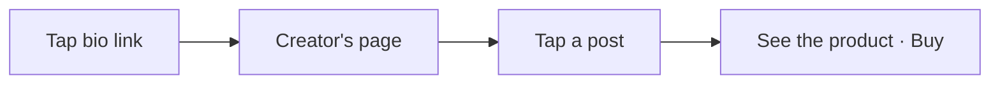
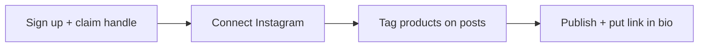
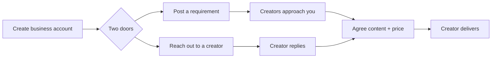

# Plugfolio — Lean User Journey

*The neat, simple, clean version. One core loop. Everything else waits.*
*July 2026. Companion to the fuller docs — this is what we build first.*

---

## The one idea

> A creator turns their content into a page where every post is shoppable.
> A follower taps a post and buys. No account, no friction.

That's the whole product for v1. If a feature doesn't serve that sentence, it's not in v1.

---

## Three roles, one clean rule

| | **Shopper** | **Creator** | **Business** |
|---|---|---|---|
| Account to shop / browse? | No | — | — |
| Account for anything else? | Only to **follow or comment** | Yes | Yes |
| Wants | Buy the thing they just saw | Turn content into sales | Find creators to work with |
| Does | Taps a post, buys | Builds one shoppable page | Posts a requirement, negotiates a collab |

**The one clean rule: an account is never the price of shopping.** You buy with no account, ever. You only sign in when you want to *act as yourself* — follow a creator, leave a comment, or operate as a business. That's the whole identity model:

> **Shop → no account.  Follow / comment → shopper account.  Sell → creator account.  Hire → business account.**

---

## The shopper journey (no login to shop)

Four steps. Nothing between the follower and the product.

1. **Arrive.** They tapped `plugfolio.com/handle` from a creator's bio. The page loads instantly and shows the creator, their content grid, nothing else in the way.
2. **Tap a post.** The reel or photo opens with its tagged product shown right there — "this is what's in the video."
3. **See the product.** Photo, price, the post it came from, one Buy button.
4. **Buy.** The button sends them to the retailer through the creator's own affiliate link. The retailer's network credits the creator directly — Plugfolio just measures the tap. The shopper just shops.

No popup. No signup wall. No wishlist to manage, no rewards to understand, no feed to build. If it isn't "tap, see, buy," it isn't here yet.

**The one optional account.** If a shopper wants to **follow** a creator (so their new posts show up later) or **comment** on a creator's page, *then* they create a lightweight shopper account — email sign-in, nothing more. Buying never asks for it; only these two social actions do. Follow and comment are the *only* things behind that door in v1.

---

## The creator journey (four steps to live)

1. **Sign up and claim a handle.** Email sign-in. The handle is the URL: `plugfolio.com/yourhandle`. No follower minimum, no approval.
2. **Connect Instagram.** One tap. Posts import automatically. (One platform for v1 — TikTok and YouTube come later.)
3. **Tag products.** Open a post, paste any product URL — Plugfolio grabs the image, title, and price. Add the affiliate link. Done.
4. **Publish.** The page builds itself from the tagged posts. One click makes it live. Copy the link into the Instagram bio.

The moment that sells them: **seeing their own reel become shoppable.** Onboarding drives straight at that and stops.

---

## The creator's dashboard — four tabs, not thirteen

The public page is the shop window. The dashboard is the back room, and it stays small:

| Tab | What's there |
|---|---|
| **Posts** | Every imported post. Tap one to tag its products. That's the core tool. |
| **Products** | The things they've tagged. Fix a link, remove one. |
| **Earnings** | Clicks and outbound taps, tied to the post that drove them: "this reel drove 312 taps." Where the creator's affiliate network reports conversions back, those sales show too — always honestly labeled *tracked* vs. *estimated*. |
| **Collabs** | Two lists in one place: **open requirements** businesses have posted (approach any that fit) and **incoming requests** from businesses who reached out — each a simple thread to agree content and price. |

No media kit, no coupon scheduler, no payouts console in v1. Four tabs a creator understands in ten seconds.

**v1 handles no money.** The creator brings their own affiliate links; the retailer's network pays them directly, on the network's own schedule. Plugfolio measures the traffic and never sits in the payment path — which is exactly why there's no payout infrastructure to build yet. Plugfolio-owned commissions and payout rails are a deliberate later step (see below).

---

## One kind of product

v1 sells **affiliate products only** — buy button goes to the retailer through the creator's own affiliate link, the tap is tracked, and the network pays the creator its commission directly.

No in-store deals. No guest checkout for the creator's own goods. No three-column product-type table to explain. One type, one buy path — and Plugfolio never handles the money.

---

## The business journey (collabs, both directions)

A business is a brand or store that wants creators to make content. In v1 they get one focused surface — no campaign suites, no dashboards of dashboards — with **two ways to meet a creator**:

1. **Create a business account.** Name, what you sell, a logo. That's the sign-up.
2. **Post a requirement** *(door one — creators come to you).* Describe the brief: the product, the kind of content you want, a budget or price range, and a deadline. It lists on an open board; creators who fit tap **Approach** and a thread opens.
3. **Or reach out to a creator** *(door two — you go to them).* Browse creator pages, and when one fits, send a collab request straight to their **Collabs** tab.
4. **Bargain in a thread.** Both sides negotiate **content and price** in one simple conversation — what gets made, for how much, by when. No email chains, no DMs.
5. **Agree and deliver.** Once both accept the terms, the creator makes the content. (How money actually changes hands stays off-platform in v1 — same "Plugfolio handles no money" rule; on-platform payment for collabs is a later step.)

That's the entire business side: **post a requirement, or approach a creator, then bargain and agree.** Discovery-by-performance, gifting logistics, and campaign management stay deferred — they're the mature-platform layer, not the first clean version.

---

## What we deliberately left out (and when it can return)

Cutting these is the point. Each is a real feature — just not part of the first clean loop.

| Deferred | Why it waits |
|---|---|
| Referral / share-to-earn rewards | Powerful, but adds an economy to explain before the core loop is even proven. |
| Anonymous wishlist + price alerts | Needs device identity and notification plumbing; not on the buy path. |
| Aggregated "My Creators" feed + Instagram follow-list import | Following a creator is in v1 (see the shopper account); the *payoff* is a simple followed-creators list. The rich aggregated feed and the five-step JSON-import are the deferred part. |
| In-store / local deals | Different buy model (offline redemption). Adds a second product type. |
| Ratings + "actually uses this" badge | Commenting is in v1 (behind the shopper account); star ratings and the authenticity badge are the deferred trust layer. |
| Media kit, brand discovery-by-performance, campaign & gifting suites | The heavy brand side. In v1 a business vets creators from their public page and meets them through the Collabs thread — the rest comes after density exists. |
| On-platform collab payments | Collab terms are agreed in v1; money changes hands off-platform for now, same "Plugfolio handles no money" rule. |
| Coupons, availability windows, bundles | Merchandising polish. Layer on once the basics convert. |
| TikTok + YouTube sync, AI tag suggestions | Scale and convenience. Instagram-only proves the loop first. |
| Favorite buyers, creator-to-creator collabs | Relationship infrastructure for a mature platform. (Business-to-creator collab *is* in v1.) |
| Plugfolio-owned commissions + payout rails | Only needed once Plugfolio sits in the payment path (its own product sales, or owning the affiliate-network relationship to earn a share). In v1 the networks pay creators directly, so there's nothing to remit. |

The rule for adding any of them back: **it must not add a step to "tap, see, buy" or a screen the creator has to learn.**

---

## Success looks like one number per role

- **Creator:** sign-up to a live, shoppable page in under five minutes.
- **Shopper:** bio-link tap to a tracked Buy click in three taps — with zero account.
- **Business:** account to a first creator conversation (post a requirement or send a request) in under five minutes.

If all three are true, the loop works and it funds itself. Everything else is a later chapter.

---

*Fuller feature set and long-term vision live in [`plugfolio-features-and-journeys.md`](./plugfolio-features-and-journeys.md) and [`plugfolio-product-document.md`](./plugfolio-product-document.md). This doc is what ships first.*
