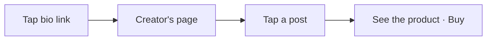
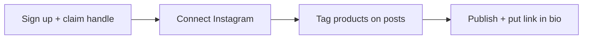

# Plugfolio — Lean User Journey

*The neat, simple, clean version. One core loop. Everything else waits.*
*July 2026. Companion to the fuller docs — this is what we build first.*

---

## The one idea

> A creator turns their content into a page where every post is shoppable.
> A follower taps a post and buys. No account, no friction.

That's the whole product for v1. If a feature doesn't serve that sentence, it's not in v1.

---

## Two people, one loop

| | **Creator** | **Shopper** |
|---|---|---|
| Has an account? | Yes | Never |
| Wants | Turn content into sales | Buy the thing they just saw |
| Does | Builds one shoppable page | Taps a post, buys |

There is no third role, no brand tools, no admin persona in v1. Just these two, connected by one link.

---

## The shopper journey (no login, ever)

Four steps. Nothing between the follower and the product.

1. **Arrive.** They tapped `plugfolio.com/handle` from a creator's bio. The page loads instantly and shows the creator, their content grid, nothing else in the way.
2. **Tap a post.** The reel or photo opens with its tagged product shown right there — "this is what's in the video."
3. **See the product.** Photo, price, the post it came from, one Buy button.
4. **Buy.** The button sends them to the retailer through the creator's own affiliate link. The retailer's network credits the creator directly — Plugfolio just measures the tap. The shopper just shops.

No popup. No signup wall. No wishlist to manage, no rewards to understand, no feed to build. If it isn't "tap, see, buy," it isn't here yet.

---

## The creator journey (four steps to live)

1. **Sign up and claim a handle.** Email sign-in. The handle is the URL: `plugfolio.com/yourhandle`. No follower minimum, no approval.
2. **Connect Instagram.** One tap. Posts import automatically. (One platform for v1 — TikTok and YouTube come later.)
3. **Tag products.** Open a post, paste any product URL — Plugfolio grabs the image, title, and price. Add the affiliate link. Done.
4. **Publish.** The page builds itself from the tagged posts. One click makes it live. Copy the link into the Instagram bio.

The moment that sells them: **seeing their own reel become shoppable.** Onboarding drives straight at that and stops.

---

## The creator's dashboard — three tabs, not thirteen

The public page is the shop window. The dashboard is the back room, and it stays small:

| Tab | What's there |
|---|---|
| **Posts** | Every imported post. Tap one to tag its products. That's the core tool. |
| **Products** | The things they've tagged. Fix a link, remove one. |
| **Earnings** | Clicks and outbound taps, tied to the post that drove them: "this reel drove 312 taps." Where the creator's affiliate network reports conversions back, those sales show too — always honestly labeled *tracked* vs. *estimated*. |

No media kit, no brand inbox, no coupon scheduler, no payouts console in v1. Three tabs a creator understands in ten seconds.

**v1 handles no money.** The creator brings their own affiliate links; the retailer's network pays them directly, on the network's own schedule. Plugfolio measures the traffic and never sits in the payment path — which is exactly why there's no payout infrastructure to build yet. Plugfolio-owned commissions and payout rails are a deliberate later step (see below).

---

## One kind of product

v1 sells **affiliate products only** — buy button goes to the retailer through the creator's own affiliate link, the tap is tracked, and the network pays the creator its commission directly.

No in-store deals. No guest checkout for the creator's own goods. No three-column product-type table to explain. One type, one buy path — and Plugfolio never handles the money.

---

## What we deliberately left out (and when it can return)

Cutting these is the point. Each is a real feature — just not part of the first clean loop.

| Deferred | Why it waits |
|---|---|
| Referral / share-to-earn rewards | Powerful, but adds an economy to explain before the core loop is even proven. |
| Anonymous wishlist + price alerts | Needs device identity and notification plumbing; not on the buy path. |
| "My Creators" feed + Instagram follow-list import | A whole second product. The JSON-export flow alone is five steps. |
| In-store / local deals | Different buy model (offline redemption). Adds a second product type. |
| Ratings, comments, "actually uses this" badge | Trust layer — matters once there's traffic to build trust on. |
| Media kit, brand inbox, brand marketplace | The brand side. Comes after creator + shopper density exists. |
| Coupons, availability windows, bundles | Merchandising polish. Layer on once the basics convert. |
| TikTok + YouTube sync, AI tag suggestions | Scale and convenience. Instagram-only proves the loop first. |
| Favorite buyers, creator collabs | Relationship infrastructure for a mature platform. |
| Plugfolio-owned commissions + payout rails | Only needed once Plugfolio sits in the payment path (its own product sales, or owning the affiliate-network relationship to earn a share). In v1 the networks pay creators directly, so there's nothing to remit. |

The rule for adding any of them back: **it must not add a step to "tap, see, buy" or a screen the creator has to learn.**

---

## Success looks like one number per side

- **Creator side:** a creator can go from sign-up to a live, shoppable page in under five minutes.
- **Shopper side:** a follower can go from tapping the bio link to a tracked Buy click in three taps.

If both are true, the loop works. Everything else is a later chapter.

---

*Fuller feature set and long-term vision live in [`plugfolio-features-and-journeys.md`](./plugfolio-features-and-journeys.md) and [`plugfolio-product-document.md`](./plugfolio-product-document.md). This doc is what ships first.*
