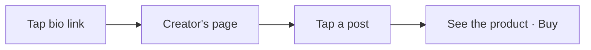
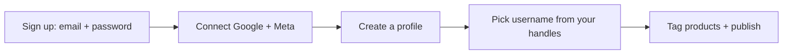
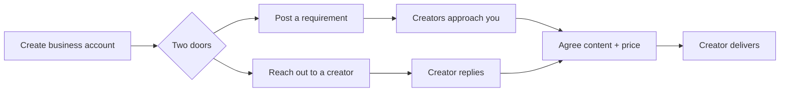

# Plugfolio — Lean User Journey

*The neat, simple, clean version. One core loop. Everything else waits.*
*July 2026. This is the product — what we build first, and the spec code follows.*

---

## The one idea

> A creator turns their content into a page where every post is shoppable.
> A follower taps a post and buys. No account, no friction.

That's the whole product for v1. If a feature doesn't serve that sentence, it's not in v1.

---

## Three roles, one clean rule

| | **Shopper** | **Creator** | **Business** |
|---|---|---|---|
| Account to shop / browse? | No | — | — |
| Account for anything else? | Only to **follow, save or comment** | Yes | Yes |
| Wants | Buy the thing they just saw | Turn content into sales | Find creators to work with |
| Does | Taps a post, buys | Builds shoppable profiles from their socials | Posts a requirement, negotiates a collab |

**The one clean rule: an account is never the price of shopping.** You buy with no account, ever. You only sign in when you want to *act as yourself* — follow a creator, save something for later, leave a comment, or operate as a business. That's the whole identity model:

> **Shop → no account.  Follow / comment → shopper account.  Sell → creator account.  Hire → business account.**

**How each account signs in:** everyone registers with **email + password** — creators, shoppers, and businesses alike. Registration sends **one verification email** carrying two ways to prove the address: a **link**, and a **six-digit code** to type on `/verify` for anyone whose in-app browser loses the tab on the way to their mail app. Verifying is also where the account **picks its username** — it is never assigned. After that, every login is just email **or username** + password — no link, no round-trip (the thing in-app browsers are worst at). Forgot password → an email **reset link**. A creator's *profile* username stays a separate thing: a public URL drawn from their connected YouTube/Instagram, and never a login (one account runs several profiles — see below).

**Every account also gets a member handle.** Whatever the role, each account carries one globally unique **`@handle`** — auto-generated at first sign-in so sign-up stays one step, changeable later in settings. It's how a person appears when they follow or comment (the email is **never** shown), and it is *not* a login either. Member handles are a separate namespace from profile usernames: a profile username is a URL and social-verified; a member handle is display-only, with no public page in v1 — so it can be free-form without inviting squatting.

---

## The shopper journey (no login to shop)

Four steps. Nothing between the follower and the product.

```mermaid
flowchart LR
    A[Tap bio link] --> B[Creator's page]
    B --> C[Tap a post]
    C --> D[See the product · Buy]
```

1. **Arrive.** They tapped `plugfolio.com/handle` from a creator's bio. The page loads instantly and shows the creator, their content grid, nothing else in the way.
2. **Tap a post.** The reel or photo opens with its tagged product shown right there — "this is what's in the video."
3. **See the product.** Photo, price, the post it came from, one Buy button — plus the code to copy when the product carries an offer.
4. **Buy.** The button sends them out — to the retailer through the creator's affiliate link, or to the creator's own store. The network credits the creator directly — Plugfolio just measures the tap. The shopper just shops.

No popup. No signup wall. Nothing to manage on the way through, no rewards to understand, no feed to build. If it isn't "tap, see, buy," it isn't here yet.

**The one optional account.** If a shopper wants to **follow** a creator (so their new posts show up later), **save** a post or a product for later, or **comment** — on a creator's page or on one of their products — *then* they create a lightweight shopper account — email + password, one verification step where they pick their `@handle`, nothing more. Buying never asks for it; only these three actions do. Follow, save and comment are the *only* things behind that door in v1. Comments thread **one level deep**: anyone can reply to a comment (the creator's answer speaks as the profile, per the rule below), but replies to replies wait.

**Save is a shelf, not a cart.** The **watchlist** — shown to shoppers as **"Saved"** (`/saved`, in the top bar and the bottom tab bar) — holds the posts and products a shopper bookmarked, newest first, each one still carrying the creator who tagged it — because "who showed me this" is half of why it was saved. It holds no price, reserves nothing and buys nothing: every card routes to that post or product's own page, where the outbound tap happens exactly as it would have the first time. Same line as the following list — a list, never a feed.

**A comment can be agreed with.** Each comment carries a **helpful / not helpful** pair with counts. It exists for one reason: a creator page's comments are mostly *questions about the goods* ("does this ship to Pune?", "is the code still live?"), and the useful answer needs to float without a moderator sorting it. One reaction per account per comment, changeable, and it needs the same shopper account follow and comment do — reading the counts never does. Deliberately **not** a rating: it scores a comment, never a product or a creator, so it can't quietly become the star-rating trust layer that's still deferred below.

**Comments can be sorted and paged.** Newest first by default, with *Oldest* and *Most helpful* alongside, and a **Load more** rather than an infinite scroll — a shopper reading answers should be able to reach the end.

**Explore carries one sponsored slot — off until an operator turns it on.** A placement is a row an operator creates in the admin app after agreeing a deal off-platform ([ADR-0020](./docs/adr/0020-sponsored-slot.md)). There is **no plan, no self-serve purchase and no billing** — §2.3 still holds — and there is **no targeting**: a placement is shown to everyone or to nobody, because this surface has no account to target against and building one to sell ads against would be the most expensive thing v1 could do to its own promise. The slot never wears a creator's clothes: no tilt, no tag pill, no price, no Buy label, labelled *Sponsored*, with a real "Why this?" disclosure. One per page, one per "Load more" batch.

**Reporting — account-free, like shopping.** Anything a shopper can see — a comment, a product, a page — carries a quiet **Report** action (reason + optional note). No account needed; the flag lands in the internal admin queue for triage. Reporting never interrupts the buy path.

**Who a comment speaks as — a smart default plus a picker.** By default a comment is signed by the commenter's **`@member-handle`**. Anyone who belongs to creator profiles (as Admin or Manager) gets an **identity picker** on the comment box and can speak **as any of those profiles** (brand name + a "Creator" badge) — on any page, including other creators' pages. The default always does the right thing untouched: on a page one of your profiles owns, it preselects **that profile** (owner replies read the way they do on Instagram/YouTube); everywhere else it preselects your personal handle — so speaking as a brand on someone else's page is always a deliberate choice, never an accident.

---

## The creator journey (connect first, then tag)

```mermaid
flowchart LR
    A[Sign up: email + password] --> B[Connect Google + Meta]
    B --> C[Create a profile]
    C --> D[Pick username from your handles]
    D --> E[Tag products + publish]
```

1. **Sign up with email + password.** Verify the email — by link or by the six-digit code — **pick a username there**, and the account is live with **nothing connected yet**. That username is the member `@handle` and a login; the *profile* username is a different thing, and belongs to profiles (see below).
2. **Connect your socials (whenever you're ready).** After the account exists, the **Admin connects one Google (YouTube) and one Meta (Instagram)** — not required at sign-up, done at the point you want to build a profile. At least one connection is needed to create a profile, and because you can only connect accounts you own, it doubles as proof of the identity behind every username.
3. **Create a profile (up to 5).** From the channels and handles those connections expose, spin up a shoppable profile. Posts import automatically. A **random username** is assigned right away so the page works instantly.
4. **Pick your username.** In profile settings, choose the public handle **from the usernames you actually have on the connected YouTube/Instagram** — nothing else is offered. That becomes `plugfolio.com/<username>`. No follower minimum, no approval.
5. **A post can be a video, not just a still.** Most creator posts are reels. The post view shows the thing the post *is* — but it loads as a **facade**: the poster frame, a play control, and the provider's name, with the real player fetched only when the shopper presses play ([ADR-0019](./docs/adr/0019-video-posts-load-as-a-facade.md)). Nothing is sent to YouTube, Instagram or TikTok until the shopper asks for it, which is the same promise every other part of the buy path makes — you agreed to nothing to be here. A "watch it there instead" link sits under the frame always, because the in-app browsers most of our traffic comes from will sometimes refuse to play an embed at all.
6. **Tag & publish.** Open a post, paste any product URL — Plugfolio grabs the image, title, and price — add the affiliate link (or mark it as **your own product** and link your store), attach a **coupon code** if you have one, and publish. Drop the link in the social bio.

The moment that sells them: **seeing their own reel become shoppable.** Onboarding drives straight at that and stops.

---

## How a creator account is built — account, profiles, roles

Three words, kept straight:

- **Account** — the login (**email or member `@handle`, plus password**; email verified once at registration, where the handle is chosen). Created on that alone; connects to **one Google and one Meta** any time afterward, and holds **up to 5 profiles**.
- **Profile** — one shoppable page with one username (drawn from a connected handle). It's what a shopper sees at `plugfolio.com/<username>`. One account, many profiles — which is exactly why the username can't be the login.
- **Connected socials** — the YouTube channel and Instagram account a profile is built on (at most one of each).

**Access to a profile — one Admin, up to three Managers.** Every profile has exactly **one Admin** (the account owner) and up to **3 Managers** invited to help run *that* profile. Two roles, nothing more granular in v1:

| Can they… | **Admin** (1 per profile) | **Manager** (up to 3 per profile) |
|---|---|---|
| Connect Google/Meta, create or delete profiles | ✅ | ❌ |
| Edit profile name, username, and settings | ✅ | ❌ |
| Post content and tag products | ✅ | ✅ |
| Change the profile picture | ✅ | ✅ |

**Connection rules:**
- Every profile keeps **at least one** social connected at all times.
- An Admin can **re-authenticate** a connection anytime (for recovery), but **can't fully disconnect a Google or Meta while a profile still depends on it** — delete the profile first.
- If a chosen handle is already taken on Plugfolio, **first verified owner keeps it**; the newcomer stays on their random username until a free handle is picked.

---

## The creator's dashboard — six tabs, not thirteen

The public page is the shop window. The dashboard is the back room, and it stays small. If the account runs several profiles, a **profile switcher** picks which one you're editing; a **Manager** sees every tab except profile settings and connections.

| Tab | What's there |
|---|---|
| **Home** | The profile you're editing, what needs tagging, the profiles you can switch to, what the account is connected to — and **Traffic**. |
| **Posts** | Every post, as a list: is it on the page, which shelf, how many products. Tap one to open its editor — the still, an optional video, the caption, the shelf, and what's tagged on it. That's the core tool. |
| **Products** | The library — a list you scan, never a CRM. Every row opens the product's own page: where it came from, whose it is, where it goes, its coupon and its shelf, with a live preview of what a shopper will see. |
| **Categories** | The profile's shelves ([ADR-0010](./docs/adr/0010-per-profile-categories.md)): add, rename, reorder, delete. Deleting never deletes content. |
| **Collabs** | Two lists in one place: **open requirements** businesses have posted (approach any that fit) and **incoming requests** from businesses who reached out — each a simple thread to agree content and price. |
| **Settings** | Identity, how the page looks, links, connections, Managers, and the one destructive action. |

**Traffic** (once called *Earnings*, until it was pointed out that it earns nothing — Plugfolio handles no money and sees no sale, so the word promised a number this product cannot produce). Three measured counts and the rate between two of them:

- **Views** — the page, a post or a product page opening ([ADR-0021](./docs/adr/0021-view-events.md)).
- **Taps** — someone leaving for a retailer, tied to the post that drove it: "this reel drove 312 taps."
- **Tap-through** — taps ÷ views. Views and taps are never shown apart, because either alone misleads: 1,284 taps sounds enormous until you see 20,410 views, and 20,410 views sounds like reach until you see how few moved.
- **Code copies** — labeled *redemption not tracked*, because redemption happens at the retailer where Plugfolio cannot see it.

Every figure is *tracked* — a directly measured event. There is no *estimated* column: v1 has no conversion source, and a plausible number here would be the one dishonest thing in the product. Where a creator's affiliate network reports conversions back, those sales join later, labeled.

**A product is not owned by the post it was tagged on.** It can sit on several posts, or on none — an in-store code has nowhere to be tagged and is still a product. So products are made and edited in their own place, and a post *connects* to one rather than containing it: connecting copies nothing, so changing a price once changes every post carrying it. Taking a product off a post is a disconnect, never a delete.

No media kit, no coupon scheduler, no payouts console in v1.

**Settings also holds how the page looks** — a bounded set, never a theme editor ([ADR-0017](./docs/adr/0017-creator-page-appearance.md)): one **accent** from five measured colours, one of three **header treatments** (Compact / Balanced / Centred), one of three **grid layouts** (Grid / Cards / List), and an optional one-line **greeting** above the name. That's the whole surface. The accent list is closed *because* it is closed — every option passes AA behind white label text, so a creator can't pick a colour that breaks the Buy button on their own page. No custom fonts, no backgrounds, no section reordering.

**v1 handles no money.** The creator brings their own affiliate links; the retailer's network pays them directly, on the network's own schedule. Plugfolio measures the traffic and never sits in the payment path — which is exactly why there's no payout infrastructure to build yet. Plugfolio-owned commissions and payout rails are a deliberate later step (see below).

---

## Categories — the creator's shelves

A profile can group its content into **categories** — each just a **title** and an optional
**description** ("Desk setup", "Budget skincare"). They belong to *that profile*, not to a
site-wide taxonomy.

- A post or product sits in **one category or none**. Uncategorized things are still live —
  they simply show under "All".
- On the public page, category chips above the grid **filter** it; "All" is the default, so
  a profile with no categories looks exactly like today.
- **Admin and Managers** both curate categories — it's content work, same tier as tagging.
- Deleting a category never deletes content; its items just fall back to "All".

One item on multiple shelves, and category pages with their own URLs, are deferred.

---

## Products — three cards, one buy model

Every product on Plugfolio is an **outbound card**: the shopper taps out, Plugfolio
measures the tap. What varies is whose product it is and whether a deal rides along:

- **Affiliate product** — the Buy button goes to the retailer through the creator's own
  affiliate link; the network pays the creator its commission directly.
- **The creator's own product** — the button goes to the creator's own site or store.
  It's their product; no commission language — Plugfolio just measures the traffic.
- **A coupon on either** — any product can carry an offer: a **code**, an optional
  expiry, and its redemption channel — **online** (copy the code, shop through the link),
  **in-store** (show the code at the shop; no link, no Buy button), or **both**. Online
  activity is *tracked* (taps + code copies); in-store redemption happens beyond
  Plugfolio's sight and is labeled honestly (code copies only) — the same *tracked vs
  estimated* discipline as Earnings.

One buy model — **outbound**. No checkout, no cart, and Plugfolio never handles the
money (§2.3). Selling the creator's own goods *through* Plugfolio (digital downloads,
merch, on-platform checkout) is the deliberate later step — see the table below.

---

## The business journey (collabs, both directions)

A business is a brand or store that wants creators to make content. In v1 they get one focused surface — no campaign suites, no dashboards of dashboards — with **two ways to meet a creator**:

```mermaid
flowchart LR
    A[Create business account] --> B{Two doors}
    B --> C[Post a requirement]
    C --> D[Creators approach you]
    B --> E[Reach out to a creator]
    E --> F[Creator replies]
    D --> G[Agree content + price]
    F --> G
    G --> H[Creator delivers]
```

1. **Create a business account.** Name, what you sell, a logo, and an **email** — businesses sign in by email. That's the sign-up.
2. **Post a requirement** *(door one — creators come to you).* Describe the brief: the product, the kind of content you want, a budget or price range, and a deadline. It lists on an open board; creators who fit tap **Approach** and a thread opens.
3. **Or reach out to a creator** *(door two — you go to them).* Browse creator pages, and when one fits, send a collab request straight to their **Collabs** tab.
4. **Bargain in a thread.** Both sides negotiate **content and price** in one simple conversation — what gets made, for how much, by when. No email chains, no DMs.
5. **Agree and deliver.** Once both accept the terms, the creator makes the content. (How money actually changes hands stays off-platform in v1 — same "Plugfolio handles no money" rule; on-platform payment for collabs is a later step.)

That's the entire business side: **post a requirement, or approach a creator, then bargain and agree.** Discovery-by-performance, gifting logistics, and campaign management stay deferred — they're the mature-platform layer, not the first clean version.

---

## What we deliberately left out (and when it can return)

Cutting these is the point. Each is a real feature — just not part of the first clean loop.

| Deferred | Why it waits |
|---|---|
| Referral / share-to-earn rewards | Powerful, but adds an economy to explain before the core loop is even proven. |
| Anonymous wishlist + price alerts | Saving *with an account* is in v1 (the watchlist — see the shopper account). Saving **anonymously** needs the device identity to carry a shelf, and alerts need price watching plus notification plumbing; neither is on the buy path. |
| Aggregated "My Creators" feed + Instagram follow-list import | Following a creator is in v1 (see the shopper account); the *payoff* is a followed-creators **list** — searchable, sortable, and marked with "N new since you last looked" per creator. That count is a fact about a row, not a feed: no post is ever merged into a stream you scroll and buy from, and every route out goes to that creator's own page. The rich aggregated feed and the five-step JSON-import stay deferred. |
| Tracked in-store redemption (card-linked offers, verified redemptions) | The *untracked* in-store coupon channel is in v1 — show the code at the counter. *Measuring* redemption means card/bank integrations; wait for local density. |
| Ratings + "actually uses this" badge | Commenting is in v1 (behind the shopper account), and so is **helpful / not helpful on a comment** — that scores an *answer*, never a product or a creator. Star ratings on products and the authenticity badge are the deferred trust layer, and the distinction is the point: one helps a shopper find the reply that answers their question, the other is a reputation system. |
| Media kit, brand discovery-by-performance, campaign & gifting suites | The heavy brand side. In v1 a business vets creators from their public page and meets them through the Collabs thread — the rest comes after density exists. |
| On-platform collab payments | Collab terms are agreed in v1; money changes hands off-platform for now, same "Plugfolio handles no money" rule. |
| Availability windows, bundles, drops | Merchandising polish. Layer on once the basics convert. (Coupon offers themselves are in v1.) |
| On-platform checkout for creator-owned goods (digital downloads first, then merch/memberships) | **The planned Phase B and the revenue model.** It's the moment Plugfolio handles money — payments, refunds, tax, payouts — and the first exception to no-login shopping. Gated on its own ADR + doc change, after the outbound loop is proven. |
| TikTok (and other platforms) + AI tag suggestions | v1 connects **YouTube + Instagram** (Google + Meta). Other platforms and AI-assisted tagging are scale/convenience layers for later. |
| More than 5 profiles per account · more than 2 role types · more than 3 managers per profile | v1 caps at 5 profiles, and per profile: one Admin + up to 3 Managers, no finer permission matrix. Bigger agency setups come later. |
| Free-form / vanity usernames not tied to a social handle | v1 usernames come only from a connected YouTube/Instagram handle — that's what makes them self-verifying. Arbitrary custom handles are a later, moderated feature. |
| Favorite buyers, creator-to-creator collabs | Relationship infrastructure for a mature platform. (Business-to-creator collab *is* in v1.) |
| Comments on posts + replies-to-replies | Comments live on the page and on products, one level deep (ADR-0013) — where the buying questions actually happen. Post threads and deeper nesting layer on if demand shows. |
| Brand-comment gating & moderation (rate limits, "only where tagged / in a collab" rules) | The identity picker *is* in v1; what waits is the anti-self-promo machinery around it. v1 leans on the personal-handle default — gating layers on if brand spam actually shows up. |
| Multi-category items + category landing pages | v1: one category per post/product, chips filter the profile grid via a param. A join table and SEO-able category URLs layer on if creators actually need them. |
| Plugfolio-owned commissions + payout rails | Only needed once Plugfolio sits in the payment path (its own product sales, or owning the affiliate-network relationship to earn a share). In v1 the networks pay creators directly, so there's nothing to remit. |

The rule for adding any of them back: **it must not add a step to "tap, see, buy" or a screen the creator has to learn.**

---

## Success looks like one number per role

- **Creator:** sign-up to a live, shoppable page in under five minutes.
- **Shopper:** bio-link tap to a tracked Buy click in three taps — with zero account.
- **Business:** account to a first creator conversation (post a requirement or send a request) in under five minutes.

If all three are true, the loop works and it funds itself. Everything else is a later chapter.

---

*Deferred features are listed above with the reason each one waits. How we build this — architecture, standards, and committed decisions — lives in [`CLAUDE.md`](./CLAUDE.md) and [`docs/adr/`](./docs/adr/).*
