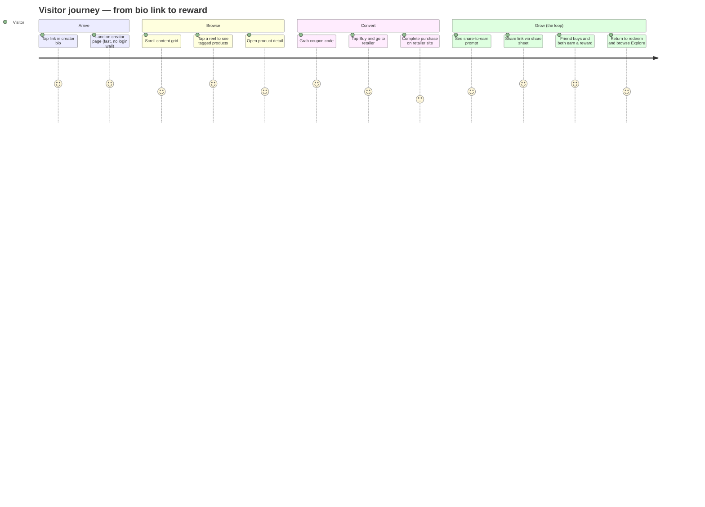
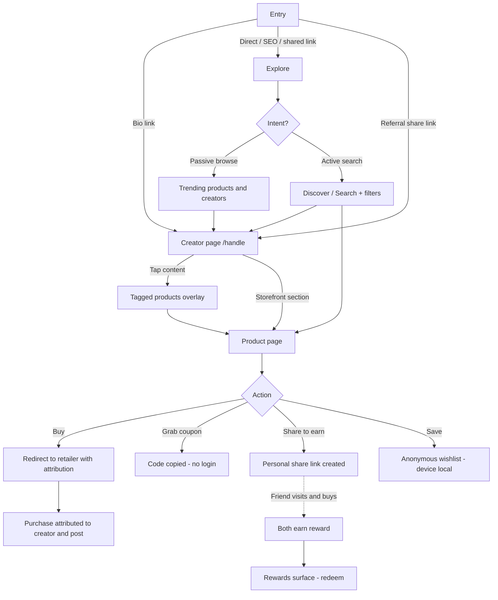
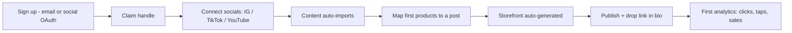
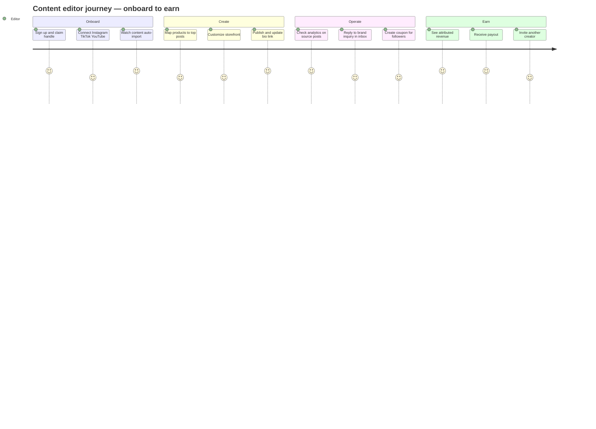
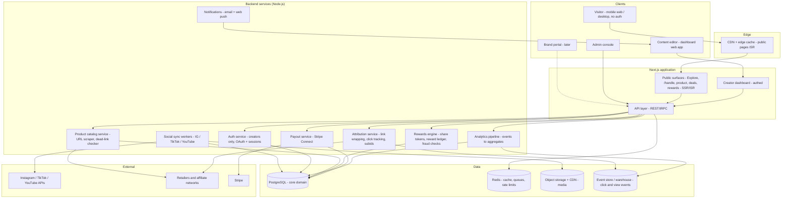
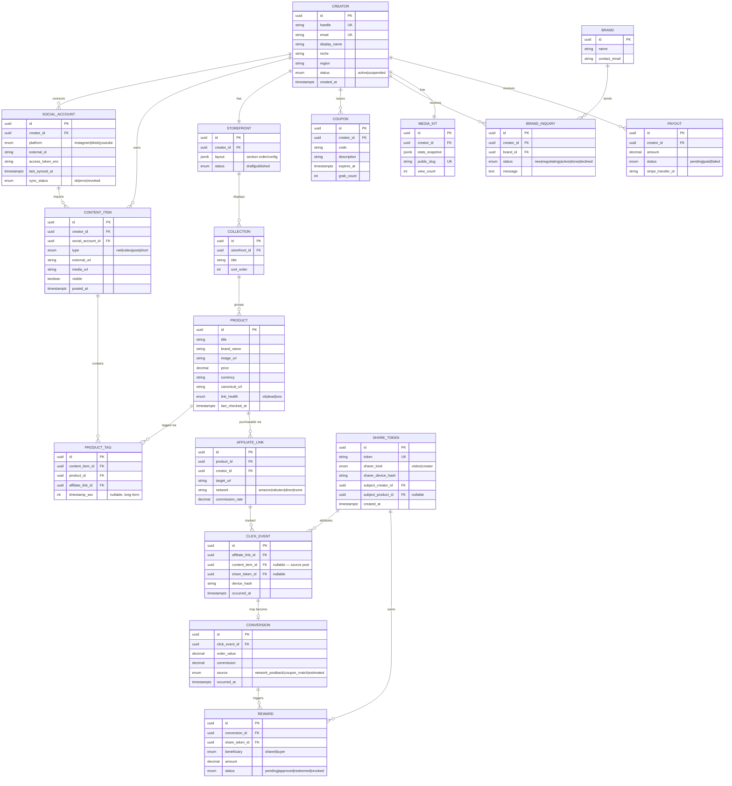
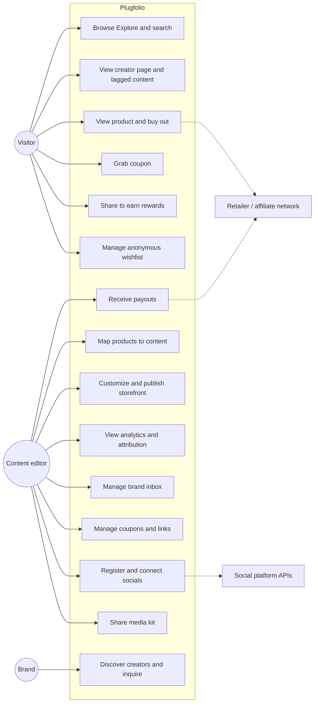
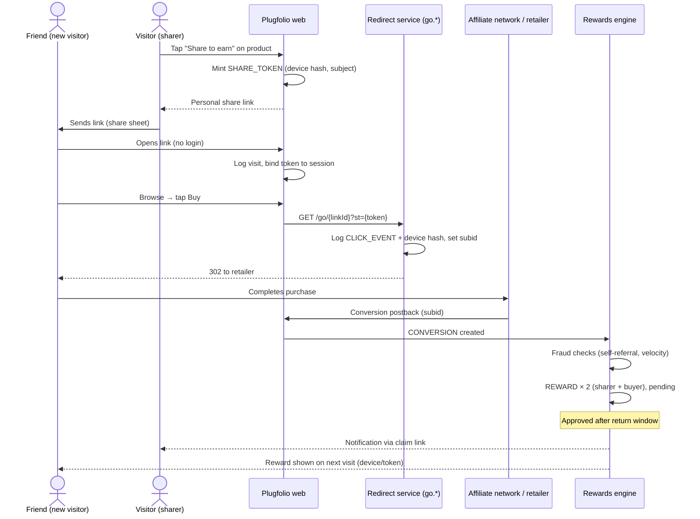
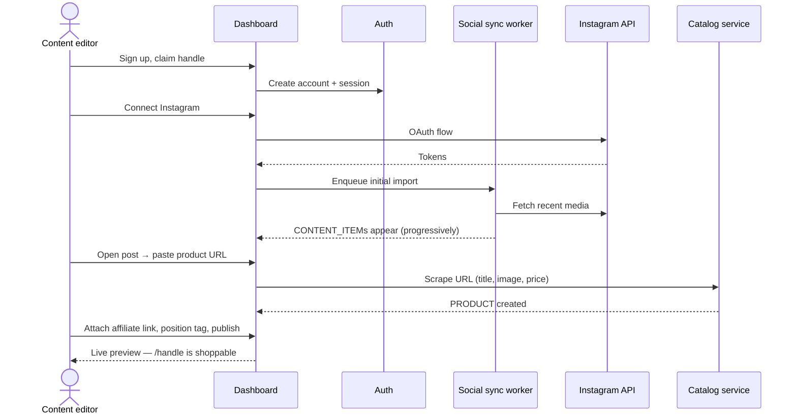
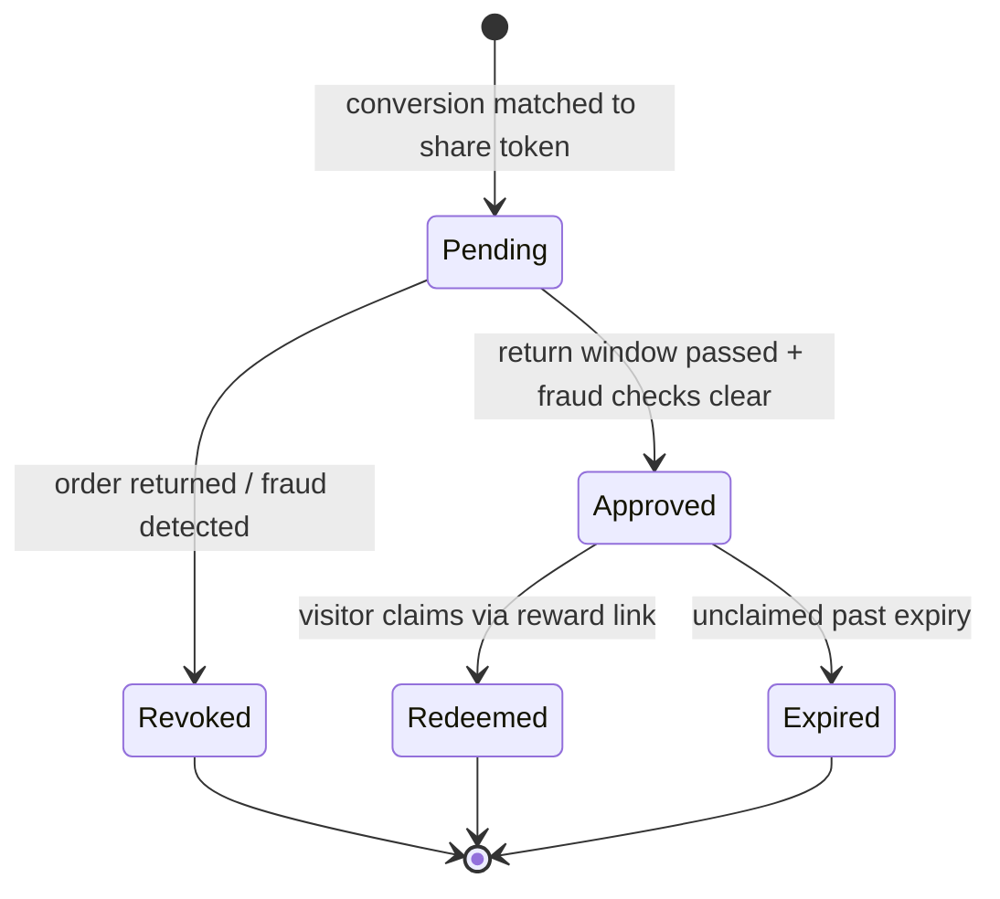

# Plugfolio — Product Specification & Design Document

*Structured spec built from the Product Document & Competitive Analysis. July 2026. Pre-launch.*

**Companion docs:** [`plugfolio-product-document.md`](./plugfolio-product-document.md) (product-owner brief) · [`plugfolio-competitive-analysis.md`](./plugfolio-competitive-analysis.md) (market landscape)

---

## Table of contents

1. [Product summary](#1-product-summary)
2. [Personas & roles](#2-personas--roles)
3. [Platform strategy — Web vs. Mobile](#3-platform-strategy--web-vs-mobile)
4. [Visitor (shopper) journey](#4-visitor-shopper-journey)
5. [Content editor (creator) journey & dashboard](#5-content-editor-creator-journey--dashboard)
6. [Feature-by-feature analysis with improvements](#6-feature-by-feature-analysis-with-improvements)
7. [High-Level Design (HLD)](#7-high-level-design-hld)
8. [Low-Level Design (LLD)](#8-low-level-design-lld)
9. [UML diagrams](#9-uml-diagrams)
10. [Prioritized roadmap](#10-prioritized-roadmap)
11. [Open decisions](#11-open-decisions)

---

## 1. Product summary

**Plugfolio turns a creator's content into a shoppable storefront** — one link (`plugfolio.com/handle`) that makes every reel, video, and post shoppable, trackable, and monetizable.

Two-sided marketplace:

- **Visitors / shoppers** (demand) — browse and buy with **zero login, ever**.
- **Content editors / creators** (supply) — gated accounts with a full dashboard to import content, map products, and track earnings.
- **Brands** (later) — light-gated tools to discover and partner with creators.

**Strategic wedge (from the competitive analysis):** content-to-product mapping is *parity* (LTK, ShopMy already do it). The differentiators to lead with, in order:

1. **Shopper-side referral & rewards loop** — nobody rewards shoppers for sharing.
2. **Truly open access + no-login shopping** — LTK gates at ~5K followers; ShopMy is invite-only.
3. **A focused beachhead** (one niche or region) to build density fast.
4. **Design & mobile-first craft.**

---

## 2. Personas & roles

| Persona | Also called | Account | Surfaces used | Primary goal |
|---|---|---|---|---|
| **Visitor** | Shopper, follower | **None — hard rule** | Public web (Explore, creator pages, product pages) | Shop what creators actually use, frictionlessly |
| **Content editor** | Creator | Registered, open to all (no follower minimum) | Creator dashboard (separate gated app area) | Turn content into revenue; look professional to brands |
| **Brand** | Partner | Light-gated (later phase) | Brand portal | Find, vet, and work with creators |
| **Platform admin** | Internal ops | Internal | Admin console | Moderation, catalog hygiene, rewards fraud control |

**The hard rule restated:** every gate between a visitor and a product costs a sale. Visitor identity is anonymous/device-based only (needed for referral attribution and wishlists — see §6.10).

---

## 3. Platform strategy — Web vs. Mobile

**Recommendation: web-first, mobile-web-first.** Visitors arrive from a bio link tapped inside Instagram/TikTok's in-app browser — that *is* mobile web. A native shopper app before density exists would be an empty app. Creators do heavy editing (mapping products, editing storefronts) which favors desktop web, plus quick checks on mobile.

- **v1:** Responsive web app, designed mobile-first. PWA installability (add-to-home-screen, offline shell) as cheap "app-like" polish.
- **v1.5:** Creator companion needs on mobile web: notifications via web push, quick-map flow.
- **v2 (decision gate):** Native shopper app **only if** metrics show repeat-visit intent that web can't serve (push-driven drops, live shopping). Native creator app only if quick-map from phone becomes the dominant workflow.

### Feature availability matrix — Web vs. Mobile

Legend: ✅ full · 🔶 optimized/reduced · ⏳ later · ❌ not planned

| Feature | Desktop web | Mobile web (v1) | Native app (v2, conditional) | Notes |
|---|---|---|---|---|
| **Visitor** |
| Explore feed | ✅ | ✅ *primary surface* | ⏳ richer (push, video feed) | Mobile is the majority entry point |
| Discover / search | ✅ | ✅ | ⏳ | Filters collapse into bottom sheet on mobile |
| Creator page (`/handle`) | ✅ | ✅ *primary surface* | ⏳ | Opens inside IG/TikTok in-app browsers — must be fast & light |
| Product view + buy-out | ✅ | ✅ | ⏳ | Redirect to retailer; attribution link wrapping |
| Coupons / deals | ✅ | ✅ | ⏳ | One-tap copy on mobile |
| Referral share & rewards | ✅ | ✅ *native share sheet* | ⏳ push notifications on reward events | Mobile share sheet is the growth engine |
| Anonymous wishlist | 🔶 localStorage | 🔶 localStorage | ⏳ synced if app account exists | Device-based, no login |
| **Content editor** |
| Registration / onboarding | ✅ | ✅ | ⏳ | Social OAuth works fine on mobile |
| Dashboard overview | ✅ | 🔶 read-mostly | ⏳ | Stats cards + notifications on mobile |
| Content-to-product mapping editor | ✅ *primary surface* | 🔶 "quick map" simplified flow | ⏳ camera/share-target integration | Full editor is desktop-grade; mobile gets a one-post-at-a-time flow |
| Storefront editor | ✅ | 🔶 reorder + toggle only | ❌ | Layout editing is desktop work |
| Media kit | ✅ view + edit | 🔶 view + share | ⏳ | Sharing a media kit happens from a phone in a DM |
| Brand-deal inbox | ✅ | ✅ | ⏳ push | Reply speed matters — full mobile support |
| Analytics | ✅ full | 🔶 summary view | ⏳ | Deep tables desktop-only |
| Payouts & settings | ✅ | 🔶 balance + status | ⏳ | Bank/KYC forms desktop-preferred |
| **Brand (later)** |
| Creator discovery, media-kit view, inquiries | ✅ | 🔶 | ❌ | B2B — desktop web is enough |

---

## 4. Visitor (shopper) journey

### 4.1 What visitors SEE (no login, ever)

| Surface | What's on it |
|---|---|
| **Explore** (`/explore`) | Trending products, top creators, trending coupons, referral-bonus banners, category tiles. Editorial modules sized to look full even when supply is thin. |
| **Discover / Search** (`/search`) | Search bar, filters (category, price, creator, brand), results grid, graceful no-results state with suggestions. |
| **Creator page** (`/{handle}`) | Creator identity (avatar, bio, socials), content grid (reels/videos/posts), shoppable storefront section, active coupons, "share this shop" reward prompt. |
| **Product page** (`/{handle}/p/{product}`) | Product details, price, images, the content it appeared in, creator attribution, buy button, coupon if available, share-to-earn prompt. |
| **Category pages** (`/c/{category}`) | Curated products + creators in a category. |
| **Coupons / deals** (`/deals`) | Grabbable creator codes — copy without login. |
| **Rewards surface** (`/rewards`) | How the referral loop works, the visitor's earned rewards (device/link-based), how to redeem. |

### 4.2 What visitors can DO

- Browse everything above with **no account**.
- Tap any content piece → see tagged products → tap through to product.
- **Buy** — redirected out to the retailer through an attributed link (v1; native checkout is an open decision).
- **Grab a coupon** — one-tap copy.
- **Share to earn** — generate a personal share link for a shop/product; when a friend buys through it, both earn a reward. Attribution via link token + device fingerprint (no login).
- **Save to wishlist** — anonymous, device-local (localStorage), with a soft "claim your wishlist" path if they ever want cross-device sync.
- Report a listing / broken link.

### 4.3 Visitor journey map



### 4.4 Visitor flow (decision view)



---

## 5. Content editor (creator) journey & dashboard

Content editors get a **separate, gated dashboard** at `plugfolio.com/dashboard` (or `dash.plugfolio.com`) — completely distinct from the public visitor surfaces. Public pages are the *output*; the dashboard is the *workshop*.

### 5.1 Onboarding journey



**Activation metric:** % of registrants who map ≥1 product and publish. Every onboarding step should be skippable-but-nudged; the "aha" is seeing their own content become shoppable.

### 5.2 Dashboard — sections & what editors can do

| Dashboard section | Route | What the editor can do |
|---|---|---|
| **Overview (home)** | `/dashboard` | At-a-glance stats (visits, clicks, sales, earnings), unmapped-content nudges, brand inquiries, announcements. |
| **Content** | `/dashboard/content` | See all synced posts across platforms; filter mapped/unmapped; open the mapping editor; hide posts from the public page; re-sync. |
| **Mapping editor** | `/dashboard/content/{id}` | Tag products onto a post: search product catalog, paste any product URL (auto-scraped), attach affiliate link/code, position tags, preview visitor view, publish. |
| **Products** | `/dashboard/products` | Manage the product library: edit details, replace dead links, group into collections, see per-product performance. |
| **Storefront** | `/dashboard/storefront` | Customize the public page: about section, creator-defined category sub-pages (create/rename/reorder, add item groups), featured collections, theme within brand system, bio/links, preview as visitor, publish. |
| **Orders** *(P1.5+)* | `/dashboard/orders` | Own-product sales: order list, status (paid/delivered/refunded), buyer contact, refunds. |
| **Media kit** | `/dashboard/media-kit` | Auto-generated from synced stats (audience, reach, top content, past collabs); editor curates highlights; share as public link/PDF. |
| **Brand inbox** | `/dashboard/inbox` | Receive/respond to brand inquiries, track deal status (new → negotiating → active → done), attach deliverables. |
| **Analytics** | `/dashboard/analytics` | Clicks, top products, coupon usage, revenue — **attributed to the source post**. Date ranges, export. |
| **Coupons & links** | `/dashboard/offers` | Create/manage coupon codes, affiliate links, brand offers; toggle visibility on public page. |
| **Payouts** | `/dashboard/payouts` | Earnings balance, payout history, payment method, tax info. |
| **Referrals** | `/dashboard/referrals` | Invite other creators; track referral earnings (creator-growth side of the loop). |
| **Settings** | `/dashboard/settings` | Handle, profile, connected accounts, notifications, danger zone. |

### 5.3 Editor journey map



---

## 6. Feature-by-feature analysis with improvements

Each feature: what it is → visitor vs. editor view → web/mobile notes → **improvements** (gaps found while pressure-testing) → priority. Priority tags: **P0** = v1 launch, **P1** = fast-follow, **P2** = later.

### 6.1 Content-to-product mapping — *parity feature, P0*

- **What:** Tag real products onto any imported reel/video/post.
- **Editor:** Full mapping editor (desktop-first); mobile "quick map" for one post at a time.
- **Visitor:** Taps content → product overlay → product page.
- **Improvements:**
  1. **URL-paste auto-scrape** — paste any product URL, we extract image/title/price (ShopMy's Snapshop does this via extension; we can do it server-side with zero install).
  2. **Bulk mapping** — map one product across many posts at once (haul videos reuse items).
  3. **AI-suggested tags** — vision model proposes products from the frame; editor confirms. P1 — big editor-time saver, and a leapfrog vs. manual-only incumbents.
  4. **Dead-link detection** — nightly job flags 404/out-of-stock product links; nudge editor. Silent dead links are the #1 trust killer.
  5. Timestamped tags for long-form YouTube ("products at 4:32"). P2.

### 6.2 Shoppable storefront — *parity, P0*

- **What:** Auto-updating shop at `/{handle}`, generated from mapped products.
- **Improvements:**
  1. **Collections** (e.g. "My gym kit", "Desk setup") — curation beats a flat grid.
  2. **Customization depth as an edge** — ShopMy is criticized for limited customization; give editors real layout/theming control within the brand system.
  3. Pin/feature products; auto-sections ("Most clicked this week").
  4. Out-of-stock auto-hide (ties to dead-link detection).

### 6.3 Social sync — *parity, P0*

- **What:** Connect IG/TikTok/YouTube; content imports and stays current.
- **Improvements:**
  1. **Graceful degradation** — APIs break and rate-limit constantly; build manual upload/paste-a-post-URL fallback from day one.
  2. Sync status visibility in dashboard ("last synced 2h ago", errors surfaced plainly).
  3. Webhook-based (where platforms allow) over pure polling; poll tiers by creator activity. P1.
  4. Import history so a re-auth doesn't duplicate content.

### 6.4 Explore (visitor discovery) — *parity entering a mature space, P0*

- **What:** Trending products/creators/coupons, categories, referral banners.
- **Improvements:**
  1. **Design-for-thin-supply** — editorial modules (few, large, curated) until density exists; module system that swaps curated → algorithmic per section as supply grows.
  2. Beachhead-first ranking: boost the chosen niche/region so Explore feels dense there.
  3. Anonymous personalization — recently-viewed and category affinity from device storage, no login. P1.
  4. "New creators" module — open access means small creators must get seen, or the open-access wedge is hollow marketing.

### 6.5 Discover / Search — *P0 (basic), P1 (good)*

- **Improvements:**
  1. Graceful no-results with category/creator suggestions (already specced — keep).
  2. Search creators *and* products *and* coupons in one box, tabbed results.
  3. AI/semantic search ("minimal white sneakers under $100") — LTK has an AI chatbot; parity here is P2, don't over-invest pre-density.

### 6.6 Referral & rewards loop — *THE differentiator, P0*

- **What:** Visitor shares a shop/product → friend buys → **both** earn.
- **Improvements / must-solve:**
  1. **Define the reward** (open decision): recommended v1 = **platform credit funded from the affiliate commission margin** — no external cash cost, redeemable against future purchases via partner coupons. Model it before build.
  2. **No-login attribution design** — share token in URL + device fingerprint + claim-on-redeem. Accept imperfect attribution; err generous.
  3. **Fraud controls from day one** — self-referral detection, velocity caps, device clustering. A gamed rewards loop kills the economics silently.
  4. Reward-state visibility without login ("You've earned X — here's your claim link") via the share link itself as identity.
  5. Make sharing ambient: share CTA on product, post-coupon-grab, and post-purchase-redirect pages.
  6. **Creator-side referral too** (invite creators, earn) — separate loop, dashboard section, P1.

### 6.7 Media kit — *parity (Beacons headline feature), P1*

- **Improvements:**
  1. Auto-updating from sync stats — zero-maintenance is the whole value.
  2. Public share link with view tracking ("Brand X viewed your kit").
  3. PDF export for email pitches.
  4. Don't over-invest — match Beacons, don't beat it.

### 6.8 Brand-deal inbox — *P1 (inbox), P2 (marketplace)*

- **Improvements:**
  1. v1 can be as simple as a structured contact form → dashboard inbox (public "work with me" button on creator page).
  2. Deal pipeline states beat free-text email threads.
  3. Full brand portal (discovery, campaigns, gifting) is **P2 but strategically vital** — it's where ShopMy/LTK make real revenue. Sequence it once creator density exists.

### 6.9 Analytics & attribution — *P0 (core), P1 (depth)*

- **Improvements:**
  1. **Post-level attribution is the emotional hook** — "this reel made you $214" is the retention feature. Lead dashboards with it.
  2. Attribution chain must survive the retailer redirect: wrapped links + subid params on affiliate networks.
  3. Coupon-code attribution as fallback where link attribution breaks.
  4. Honest data labeling — show "tracked" vs. "estimated" revenue; creators distrust inflated numbers.

### 6.10 Anonymous wishlist — *P1*

- **Resolves the open question:** device-local (localStorage) — no login, consistent with the hard rule. Cross-device sync only via optional email-magic-link "claim", never a wall.
- ShopMy keeps wishlist items commissionable indefinitely — match that.

### 6.11 Coupons / deals — *P0*

- **Improvements:**
  1. One-tap copy + auto-open retailer.
  2. Expiry/scarcity display ("2 days left") — drives urgency and repeat visits.
  3. Coupon-grab as attribution event (feeds analytics + rewards).

### 6.12 Payouts — *P0 (must work), keep minimal*

- Stripe Connect (or regional equivalent for a non-US beachhead — verify per chosen region). Balance, history, threshold payouts. No innovation needed here; reliability only.

### 6.13 Product types — affiliate, in-store deals, own products

Every product/offer a creator publishes is one of three types. Each has a different buy path, revenue model, and phase:

| Type | Buy path | Revenue | Phase |
|---|---|---|---|
| **Affiliate product** | Redirect to external retailer with attributed link; optional "use my code at checkout" coupon | Affiliate commission share | **P0** (the existing core path, §6.1/§8.4) |
| **In-store deal** | No online checkout — visitor sees the deal, visits the physical store, redeems during the validity period | Creator-brand arrangement; platform value = traffic proof + future brand tools | **P1** |
| **Own product** | **Native checkout through Plugfolio's payment gateway**, settled to the creator's account | Transaction fee on gateway sales | **P1.5 (digital) → P2 (physical)** |

**In-store deals (P1)** — a creator announces a discount at a physical store: *"this store in this area has 20% off until Sunday — applicable to all products in store."*
- Fields: store name, location (area text + geo point), discount description, validity window (`starts_at`/`ends_at`), redemption note ("show this screen" / "mention my name" / code).
- Deal is store-scoped, not product-scoped — it can cover everything in the store.
- Visitor surfaces: creator page, `/deals`, and an Explore **"deals near you"** module (browser geolocation with permission, or a manual area picker — no login).
- **This is genuine whitespace:** no incumbent (ShopMy, LTK, Linktree) touches offline/local deals — and it's a natural fit for a regional beachhead where local-store culture is strong.
- LLD: new `IN_STORE_DEAL` entity (creator_id, store_name, area, lat/lng, discount_text, starts_at, ends_at, redemption_note, grab_count).

**Own products (P1.5 → P2)** — the creator's own merchandise/products, sold directly:
- Listing with price, stock, images; guest checkout via Plugfolio's payment gateway (Stripe or regional equivalent); funds settle to the creator's account on the existing payout rails.
- Buyer stays no-login: **guest checkout** — email only for receipt/delivery, never an account.
- Start with **digital-friendly** products (no shipping complexity), add physical (shipping address, fulfillment status) at P2.
- Requires: order management in the dashboard (new **Orders** section), refund/dispute policy, KYC on the creator (already partly needed for payouts).
- **This updates open decision #4 to a hybrid:** redirect for affiliate products, native checkout *only* for own products.
- LLD: `ORDER` (buyer_email, product_id, amount, status: pending|paid|delivered|refunded, payment_ref), `PRODUCT.type` enum (affiliate|own), `PRODUCT.stock`.

### 6.14 Creator page structure — about page + category sub-pages + video embeds

The public creator surface becomes a small site, not a single page:

- **Main page (`/handle`)** — about the creator: bio, photo, social accounts, highlights, featured categories, active coupons/deals.
- **Category sub-pages (`/handle/{category}`)** — creators create their **own categories** ("Gym kit", "Skincare", "Kitchen") and add groups of items to each. Each category is a real page with its own shareable URL (and SEO value). This evolves §6.2 collections into navigable sub-pages: unlimited categories, creator-defined names and ordering, per-category visibility.
- **Video preview embedding** — every product can be attached to the YouTube/Instagram video it appears in, with an **embedded preview** on the product page and category grid:
  - YouTube: standard oEmbed/iframe — reliable everywhere.
  - Instagram: official embed where allowed; **fallback to thumbnail + tap-out** inside in-app browsers where IG embeds are restricted. Never let a blocked embed break the page.
  - This makes the mapping bidirectional: content → products (tap a post, see products) *and* product → content (product page plays the video it came from).
- LLD: `COLLECTION` extends to `CATEGORY_PAGE` (title, slug, sort_order, visible); `PRODUCT_TAG` gains embed metadata (provider, embed_url, thumbnail_url).

### 6.15 Plug Connect — connections, favorites, and trackable relationships

The relationship layer between shoppers and creators, and between creators:

- **Shopper → creator connect (P1.5).** A visitor taps **Connect** on any creator page to follow them on-platform; their connected creators power the "My Creators" feed (new products, coupons, drops). Device-based identity, same anonymous model as the wishlist — the follow-list import (§6.16) is simply *bulk connect*. Optional magic-link claim for cross-device.
- **Creator ↔ creator connect (P2).** Creators connect with each other — the foundation for collabs (§6.17): cross-tagging, shared collections, commission splits, and a "creators I work with" strip on the public page.
- **Favorite buyers (P2).** A creator can tag shoppers as **favorites**; a favorite is **highlighted whenever they act** — buys, shares, grabs a coupon — in the creator's analytics and notifications, and can be granted perks (early access to drops, exclusive coupons).
  - *Honest constraint:* fully anonymous visitors can't be favorited — there's nothing stable to tag. Favorites work on **known shoppers**: those who claimed an identity via the magic-link (rewards claim, wishlist claim, circle claim) or a stable repeat device. This defines the identity ladder: **anonymous → claimed → favorite**, and never forces a login to shop.
- **Full traffic tracking (P0 — extension of §6.9/§8.4).** Every visit and click already flows through the attribution chain; expose the **source dimension** end-to-end: bio link, share link, Explore, search, category page, connect feed, direct, external referrer — as a "traffic sources" breakdown per post, product, and page in analytics. The creator sees *where every visitor came from*.
- **Social & collab exposure (P1).** The creator controls what's public on their page and media kit: social accounts, past collab details, and a structured **"Work with me" form** (feeds the brand inbox §6.8). Per-item public/private toggles — expose it, or keep it as a private form-only channel.
- LLD: `CONNECTION` (subject: device_hash|creator_id, target creator_id, kind: follow|creator_link), `SHOPPER_IDENTITY` (created on any magic-link claim; links device hashes, rewards, wishlist, circle, connections), `FAVORITE_BUYER` (creator_id, shopper_identity_id, note).

### 6.16 Instagram follow-list import → "My Creators" circle — *P1.5*

- **What:** A visitor (or creator acting as a shopper) imports the list of accounts they follow on Instagram; Plugfolio matches it against creators on the platform and auto-builds a personalized **"My Creators" circle** — one shoppable feed across every creator they already follow. (ShopMy ships this as "Circles"; this is our version of the multi-creator discovery bet from the product doc §9.)
- **Why the awkward import flow:** Instagram's API does not expose who a *user* follows. The only compliant path is Instagram's own **Download Your Information** export. The UX must therefore be a hand-held wizard:
  1. Guided steps (with screenshots/video): Account Settings → *Download or transfer information* → *Some of your information* → Connections → **Following** → Export to device → Date range **All time** → Format **JSON** → Create file.
  2. Set expectation up front: *"Instagram emails you the file — this can take up to an hour."* Send an optional web-push/email nudge path so the user comes back when it arrives.
  3. User uploads / drags in the ZIP or `following.json`.
- **Privacy edge — parse client-side:** the export can contain far more than the follow list. Parse `following.json` **in the browser**, extract handles only, and send just the handle list — the raw file never leaves the device. State this in the UI; it's a trust differentiator.
- **No-login handling:** the resulting circle is stored device-side (same anonymous model as the wishlist), with the same optional magic-link "claim" for cross-device. For registered creators it attaches to their account.
- **Mechanics:** matched handles → circle feed (new products, coupons, drops from those creators, sorted by recency); unmatched handles → a *"invite them to Plugfolio"* prompt — which doubles as a creator-acquisition loop (shoppers pull their favorite creators onto the platform).
- **LLD notes:** `CIRCLE` (id, device_hash / creator_id, created_at) + `CIRCLE_MEMBER` (circle_id, matched creator_id). Client-side parser for Instagram's export shape (`relationships_following[].string_list_data[].value`); tolerate format drift with a server-side fallback parser. Re-import supported (upsert, don't duplicate).
- **Improvements over ShopMy's version:** client-side parsing (privacy), no account required to build a circle, and the unmatched-creator invite loop.

### 6.17 Good-to-have backlog

Not part of the wedge or parity core — build after the loop works. Each entry: what it is, why it earns a place, and how it respects the no-login rule.

#### Visitor-facing

| Feature | What & why | No-login handling | Priority |
|---|---|---|---|
| **Anonymous wishlist** | Device-local saves (see §6.10); saved items stay commissionable indefinitely (match ShopMy). | localStorage; optional email magic-link "claim" for cross-device — never a wall. | P1 |
| **Price-drop / back-in-stock alerts** | Web-push alert on a wishlisted item. Strongest repeat-visit driver that needs no account. | Push subscription is per-device — no identity needed. Rides on the link-health checker (§6.1) which already re-crawls prices/stock. | P1 |
| **Recently viewed + anonymous personalization** | "Picked for you" and "continue browsing" modules on Explore, from device-side history and category affinity. | Entirely client-side profile (localStorage), sent as hints to the Explore API. | P1 |
| **"Shop the look" bundles** | One tap shows every product in an outfit/setup as a purchasable set; editor groups tags into a "look" in the mapping editor. | Public content — nothing to gate. | P1.5 |
| **Trending-now / drops surface** | Time-limited coupons and product drops ("24h only") on Explore; urgency drives return visits and gives creators a promo lever. | Public. Needs scheduled coupons (below) as the supply side. | P1.5 |

#### Trust & authenticity

| Feature | What & why | No-login handling | Priority |
|---|---|---|---|
| **"Actually uses this" verification badge** | Auto-badge when a product appears in ≥N organic posts over time — a credible authenticity signal no incumbent has, computed from data we already hold (`PRODUCT_TAG` × `CONTENT_ITEM.posted_at`). | Computed, not user-generated — nothing to gate. | P1 |
| **Reviews — rating + comments** | Star rating **and** text comment on products, aggregated as social proof (and SEO content). | Rating: anonymous one-tap, device-hash + rate limits. Comment: needs accountability — email magic-link verification per comment (the one deliberate exception to pure anonymity; never a wall on browsing/buying). Moderation queue for text. Ship ratings first (P1.5), comments after (P2). | P1.5 / P2 |
| **Media-kit view tracking** | "Brand X viewed your kit 3× this week" — makes the media kit feel alive and prompts follow-up (see §6.7). | Editor-side feature; brand views tracked via kit share-link tokens. | P1 |

#### Content-editor-facing

| Feature | What & why | Notes | Priority |
|---|---|---|---|
| **Best-time-to-post / content insights** | "Reels with ≤3 tags convert 2× better", best posting windows — derived from attribution data already collected (§6.9). Cheap, high retention value. | Pure analytics rollup; no new data needed. | P1 |
| **Scheduled coupons** | Set launch/expiry windows in advance; auto-publish and auto-expire. Feeds the drops surface. | Adds `starts_at` to `COUPON`; a scheduler tick flips visibility. | P1 |
| **Scheduled products (availability window)** | Editor sets how long a product stays live (e.g. available for 2 days), after which it auto-flips to disabled/unavailable — shown as "no longer available" or hidden. Powers limited-time drops and urgency ("available for 2 more days"). | Adds `available_from` / `available_until` to `PRODUCT_TAG`; scheduler tick flips state; visitor UI shows a countdown while live. | P1.5 |
| **Creator collabs** | Co-owned collections, tagging another creator's product with commission split. Doubles as a creator-growth loop (collab invites). | Needs a `commission_split` on `AFFILIATE_LINK` and a collab invite flow. | P2 |
| **AI-suggested tags & bulk mapping** | Covered in §6.1 — listed here for backlog completeness. | — | P1 |
| **Digital products / tips** | Stan/Beacons territory — sell digital goods, accept tips. A different business (payments, delivery, disputes); only if creators demand it. | Requires native checkout — coupled to open decision #4. | P2 |

---

## 7. High-Level Design (HLD)

**Stack assumptions:** Next.js (App Router) + TypeScript, Node.js services, PostgreSQL, Redis, object storage + CDN. Public surfaces are SSR/ISR for speed and SEO; dashboard is an authed SPA region of the same app.



**Key HLD decisions:**

| Decision | Choice | Why |
|---|---|---|
| Public pages | SSR/ISR behind CDN | Creator pages open inside IG/TikTok in-app browsers; must be instant and SEO-visible. |
| Auth scope | Creators (and later brands) only | Visitors never authenticate — enforced architecturally, not just by policy. |
| Social sync | Async workers + queue, webhook where possible | Third-party APIs are slow/flaky; never block user flows on them. |
| Attribution | Dedicated redirect service (`go.plugfolio.com/...`) | Every outbound click passes through us — the analytics and rewards backbone. |
| Events | Append-only event stream, aggregated async | Clicks/views are high-volume; keep OLTP clean. |
| Monolith vs. microservices | **Modular monolith** at v1, workers split out | Pre-launch scale doesn't justify service sprawl. |

---

## 8. Low-Level Design (LLD)

### 8.1 Domain model (ER diagram)



Notes: `CLICK_EVENT` lives in the event store, aggregated into Postgres rollups for dashboards. `CONVERSION.source` makes the "tracked vs. estimated" honesty (§6.9) a first-class field. `SHARE_TOKEN.sharer_device_hash` is the no-login identity for rewards.

### 8.2 Module layout (modular monolith)

```
plugfolio/
  apps/
    web/                      # Next.js — public surfaces + dashboard
      app/(public)/           # explore, [handle], p/[product], deals, rewards, c/[category]
      app/(dashboard)/        # dashboard/* — authed layout, editor sections (§5.2)
      app/api/                # route handlers → modules
  packages/
    modules/
      auth/                   # creator sessions, OAuth, handle claims
      content/                # content items, sync ingestion, visibility
      catalog/                # products, scraper, dead-link checker
      mapping/                # product tags, bulk ops, AI suggest (P1)
      storefront/             # layout, collections, publish
      attribution/            # link wrapping, click ingest, conversion match
      rewards/                # share tokens, ledger, fraud rules
      analytics/              # aggregates, per-post revenue
      inbox/                  # brand inquiries, deal states
      payouts/                # stripe connect wrapper
    workers/
      social-sync/            # per-platform pollers + webhook receivers
      link-health/            # nightly dead-link sweep
      event-rollup/           # click/view events → aggregates
    ui/                       # shared design system (Charged Violet)
```

### 8.3 Key API surface (representative, not exhaustive)

| Endpoint | Auth | Purpose |
|---|---|---|
| `GET /api/public/explore` | none | Explore modules (cached, per-region variant) |
| `GET /api/public/creators/{handle}` | none | Creator page payload |
| `GET /api/public/products/{id}` | none | Product detail + attribution context |
| `POST /api/public/share-tokens` | none (rate-limited) | Mint a visitor share link |
| `POST /api/public/coupons/{id}/grab` | none | Coupon grab event |
| `GET /go/{linkId}?st={shareToken}` | none | **Attributed redirect** to retailer |
| `POST /api/dashboard/social-accounts` | creator | Connect a social account (OAuth) |
| `GET /api/dashboard/content?mapped=false` | creator | Unmapped content queue |
| `POST /api/dashboard/content/{id}/tags` | creator | Add product tag (inline URL-scrape) |
| `PUT /api/dashboard/storefront` | creator | Save layout / publish |
| `GET /api/dashboard/analytics/posts` | creator | Per-post attributed revenue |
| `POST /api/webhooks/affiliate/{network}` | HMAC | Conversion postbacks |

### 8.4 Attribution & rewards mechanics (the critical LLD path)

1. Every buy button points at `go.plugfolio.com/{linkId}` with optional `?st={shareToken}`.
2. Redirect service logs `CLICK_EVENT` (link, source post, share token, device hash), appends network subid (`subid=clickEventId`), 302s to retailer. Latency budget: <100 ms.
3. Affiliate network postback → `POST /api/webhooks/affiliate/{network}` → match subid → create `CONVERSION`.
4. Rewards engine: conversion has a share token → run fraud rules (self-referral device match, velocity caps) → create two `REWARD` rows (sharer + buyer), status `pending` → `approved` after the network's return window.
5. Where no postback exists → coupon-code match or `estimated` conversion (labeled as such in analytics).

---

## 9. UML diagrams

### 9.1 Use-case diagram



### 9.2 Sequence — visitor purchase with referral attribution



### 9.3 Sequence — creator onboarding & first mapping



### 9.4 State diagram — reward lifecycle



---

## 10. Prioritized roadmap

### v1 — Beachhead launch (P0)

The minimum that proves the wedge: open access, no-login shopping, working rewards loop, in one niche/region.

1. Creator onboarding + social sync (with manual-URL fallback)
2. Mapping editor (desktop) + URL auto-scrape
3. Public creator page (about + category sub-pages) + product page with video embed + coupons (mobile-web-first, SSR)
4. Attributed redirect service + click analytics + per-post revenue + traffic-source breakdown
5. **Referral rewards loop** (share tokens, ledger, fraud basics)
6. Explore (editorial, thin-supply design) + basic search
7. Payouts (Stripe Connect or regional equivalent)
8. PWA polish

### v1.5 — Retention & parity (P1)

- AI-suggested tags, bulk mapping, dead-link detection
- Storefront collections + customization depth
- Media kit (+ view tracking) + brand inquiry form/inbox
- Anonymous wishlist + price-drop/back-in-stock alerts, better search, recently-viewed personalization
- "Actually uses this" verification badge, content insights (best-time-to-post), scheduled coupons
- **In-store deals** (creator local-store discounts + "deals near you" on Explore)
- Social & collab exposure controls + "Work with me" form
- Creator referral program, web push notifications, mobile quick-map
- *(P1.5 tail: "shop the look" bundles, trending-now/drops surface, product availability windows, product ratings, Instagram follow-list import → "My Creators" circle, shopper→creator Connect, own products — digital, with guest checkout + Orders section)*

### v2 — Expansion (P2)

- Brand portal (discovery, campaigns, gifting) — the revenue layer
- Native shopper app (only if metrics justify — decision gate)
- AI/semantic search, live/drops surfaces, creator collaborations (creator↔creator Connect, commission-split collabs)
- Own products — physical (shipping/fulfillment), favorite buyers (identity ladder: anonymous → claimed → favorite)
- Review comments (magic-link verified), digital products/tips (coupled to native checkout)
- Second niche/region

---

## 11. Open decisions

Carried from the product document, with recommendations from this spec:

| # | Decision | Recommendation in this spec |
|---|---|---|
| 1 | Monetization | Commission share on attributed conversions at v1; brand tools as the v2 revenue layer. Avoid Linktree-style visible transaction fees. |
| 2 | Beachhead | **Must be decided before Explore ranking, region payout rails, and marketing are built.** Deliberate call — this spec is parameterized by it. |
| 3 | Referral economics | Platform credit funded from commission margin (§6.6). Model before build. |
| 4 | Checkout ownership | **Hybrid (updated by §6.13):** redirect-to-retailer for affiliate products; native checkout through our gateway *only* for creators' own products (digital first at P1.5, physical at P2). |
| 5 | Mobile app vs. web | **Web-first, mobile-web-first, PWA** (§3). Native = v2 decision gate. |
| 6 | Brand-side timing | Inquiry inbox at v1.5 (cheap); full portal at v2 once creator density exists. |
